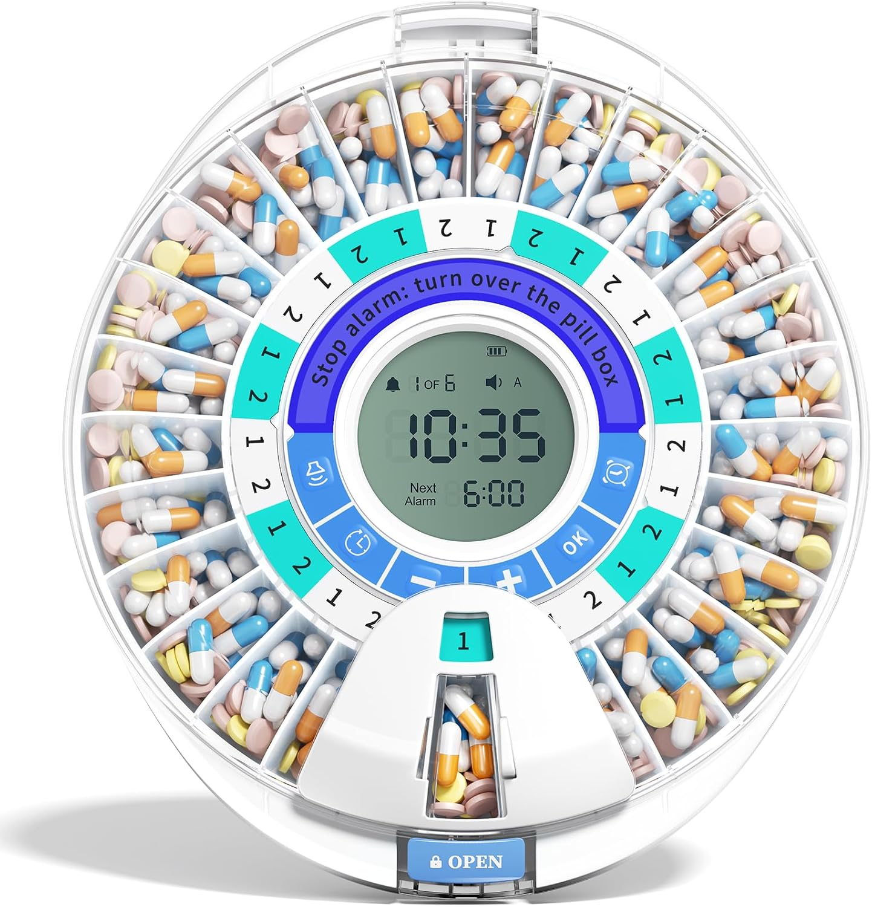
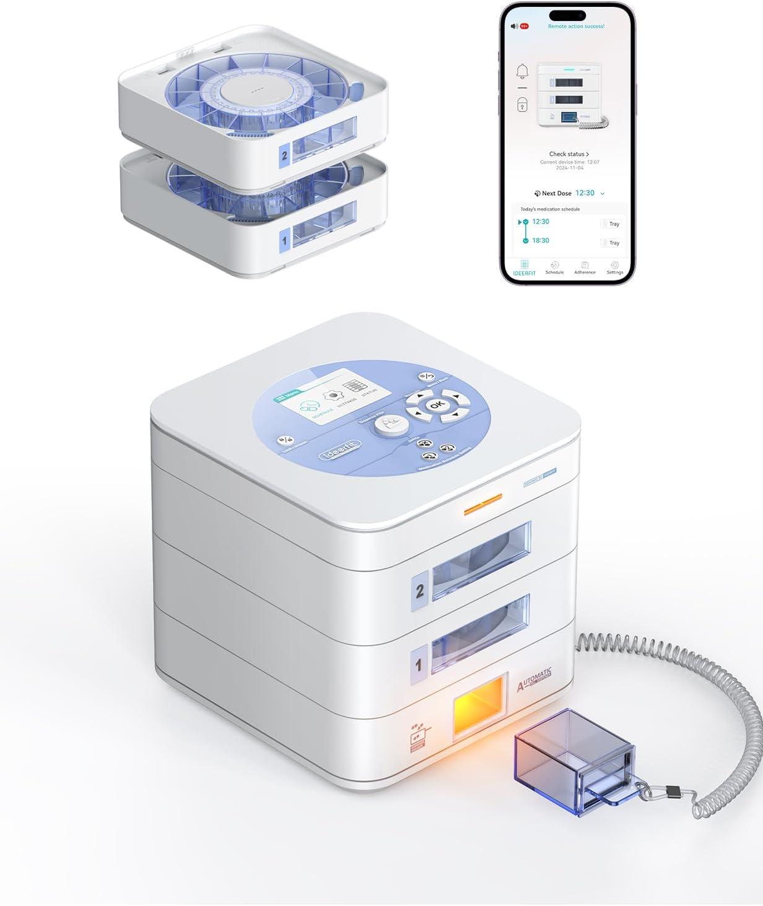
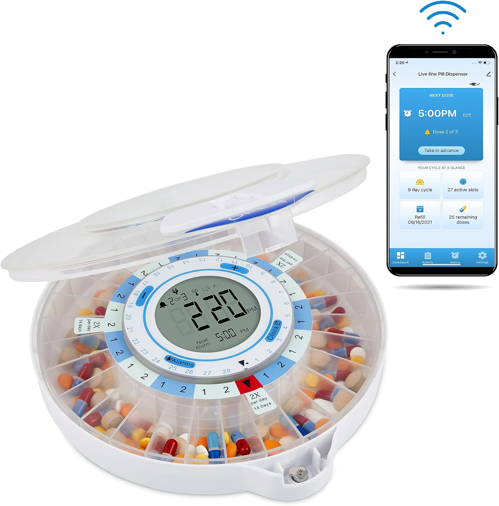
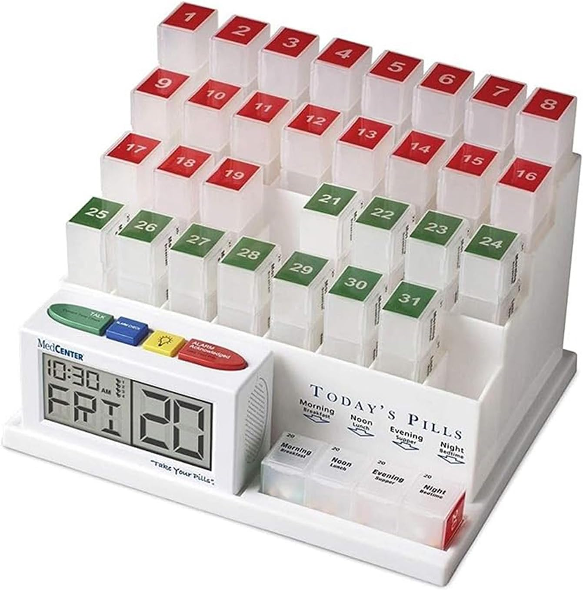
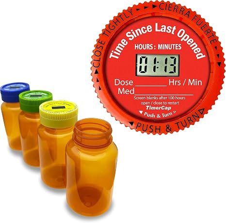
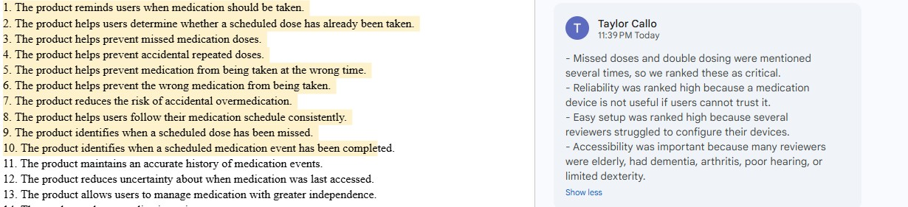

#### 5. [Windtrace Automatic Pill Dispenser for Elderly with Alarm](https://www.amazon.com/dp/B0BL2BJ24F)

* **Price:** $55.99
* **Vendor:** Amazon.
* **Brand:** Windtrace.
* **Rating:** 4.0 out of 5 stars from 1,108 ratings.
* **Description:** This pill dispenser has 28 compartments for organizing medication. It uses an alarm and flashing lights to remind users when it is time to take their pills. The tray rotates to the scheduled compartment, and the user opens the dispensing slot and tilts the device to get the pills out.
* **Connection to our project:** This product helps us understand what people need from medication reminders and storage. The reviews show what users like and what causes problems during setup, refilling, and everyday use.

##### Positive Comments

The following three positive comments come from two five-star reviews.

| Voice of the Customer | Restated Customer Need |
|---|---|
| **Kerry K., 5 stars, August 21, 2026:** “Our son had a stroke and is unable to manage his pills without this organizer. It alarms and notifies him when to take them and also prevents taking the wrong pills at the wrong time.” | 1. The device reminds users when it is time to take their medication. **(Explicit)** |
| | 2. The device helps users manage their medication with less help from others. **(Latent)** |
| | 3. The device helps caregivers worry less about missed or repeated doses. **(Latent)** |
| **cheryl samples, 5 stars, September 3, 2026:** “They can only get the doses needed at that time. They can't take the next day by accident or because they didn't think they took it.” | 4. The device helps prevent users from accidentally taking another dose. **(Explicit)** |
| **cheryl samples, 5 stars, September 3, 2026:** “Well made perfect for what we needed. No more accidental dosing and easy to set up.” | 5. The device is easy to set up and program. **(Explicit)** |

##### Negative Comments

| Voice of the Customer | Restated Customer Need |
|---|---|
| **Carole Hetrick, 1 star, September 7, 2026:** “Very confusing to set up because the paper directions were not detailed enough.” The reviewer also said the instructions did not match the device and that helping the user was difficult without being there to see the buttons. | 6. The instructions are clear and match the device being used. **(Explicit)** |
| | 7. The device lets users fix setup mistakes easily. **(Latent)** |
| | 8. The device allows caregivers to help with problems without being physically present. **(Latent)** |
| **A-OK, 1 star, September 9, 2023:** “The alarm volume is too low, even at the highest setting.” The reviewer also described a flimsy cover latch and said the dosage-ring tabs covered pills inside the compartments. | 9. The alarm is easy to hear, including for users with reduced hearing. **(Explicit)** |
| | 10. The dosage labels leave the pills visible and easy to reach. **(Explicit)** |
| | 11. The cover and locking parts hold up during normal use. **(Explicit)** |
| **Sissy D, 1 star, June 20, 2026:** “Anyone can open it, it does not lock! The only part that locks and requires a key is the battery compartment!!” | 12. The device keeps stored medication secure from unintended access. **(Explicit)** |
| | 13. The device makes it clear which parts are locked and what the lock protects. **(Latent)** |

Some reviewers said the device helped prevent extra doses, while others reported problems with the lock. These are different customer experiences, so we should consider both when developing our design.

##### Additional Comments

These reviews provide more information about refilling and getting pills out. The three-star review is used as extra feedback, rather than one of the required one- or two-star negative reviews.

| Voice of the Customer | Restated Customer Need |
|---|---|
| **Justine Frederick, 1 star, May 2, 2026:** “The lid does not open wide but stays at an angle and slams shut.” The reviewer also said this made the tray difficult to remove. | 14. The device gives users enough access to refill the medication easily. **(Explicit)** |
| **SM, 3 stars, August 13, 2026:** “Works for 2 times a day dispensing.” The reviewer also said users can see when doses have been missed. | 15. The device supports more than one medication time each day. **(Explicit)** |
| | 16. The device lets users or caregivers see when a dose has been missed. **(Explicit)** |
| **SM, 3 stars, August 13, 2026:** The reviewer said pills sometimes get stuck and must be removed with a finger. They also mentioned that getting pills out can be difficult for people with large fingers or limited dexterity. | 17. The device lets users remove the full dose without pills getting stuck. **(Explicit)** |
| | 18. The device is easy to use for people with limited finger movement. **(Explicit)** |
| **SM, 3 stars, August 13, 2026:** “The paper dial in the middle has to be taped in place as it slips.” | 19. The dosage labels stay in place during use. **(Explicit)** |
| **Based on SM's comment about using a finger to remove stuck pills:** This also suggests that users need a cleaner way to get their medication out. | 20. The device helps keep pills clean when users remove them. **(Latent)** |

##### Compiled List of User Needs

This product gave us **20 user needs: 14 explicit and 6 latent**. Explicit needs come directly from the reviews. Latent needs are things we inferred from the problems or experiences customers described.

1. The device reminds users when it is time to take their medication. **(Explicit)**
2. The device helps users manage their medication with less help from others. **(Latent)**
3. The device helps caregivers worry less about missed or repeated doses. **(Latent)**
4. The device helps prevent users from accidentally taking another dose. **(Explicit)**
5. The device is easy to set up and program. **(Explicit)**
6. The instructions are clear and match the device being used. **(Explicit)**
7. The device lets users fix setup mistakes easily. **(Latent)**
8. The device allows caregivers to help with problems without being physically present. **(Latent)**
9. The alarm is easy to hear, including for users with reduced hearing. **(Explicit)**
10. The dosage labels leave the pills visible and easy to reach. **(Explicit)**
11. The cover and locking parts hold up during normal use. **(Explicit)**
12. The device keeps stored medication secure from unintended access. **(Explicit)**
13. The device makes it clear which parts are locked and what the lock protects. **(Latent)**
14. The device gives users enough access to refill the medication easily. **(Explicit)**
15. The device supports more than one medication time each day. **(Explicit)**
16. The device lets users or caregivers see when a dose has been missed. **(Explicit)**
17. The device lets users remove the full dose without pills getting stuck. **(Explicit)**
18. The device is easy to use for people with limited finger movement. **(Explicit)**
19. The dosage labels stay in place during use. **(Explicit)**
20. The device helps keep pills clean when users remove them. **(Latent)**

### Search #1

**Keywords:** "Automatic pill dispenser"

#### 4. [28-Day (1X) Automatic Pill Dispenser (Expandable Tray)](https://www.amazon.com/Ideerfit-28-Day-Automatic-Dispenser-Device/dp/B0FD9XCZBH/ref=sr_1_5?crid=undefined&th=1)

- **Price:** $269.99
- **Vendor:** Amazon.
- **Brand:** Ideerfit.
- **Rating:** 4.1 out of 5 stars from 1,108 ratings.
- **Description:** An electronic medication dispenser designed to release scheduled doses, provide audible reminders, track dose activity, and allow caregivers to monitor medication use through an app. The system can also support remote dispensing and notifications.
- **Connection to our project:** This product relates to our project because it uses automatic dispensing, dose tracking, caregiver notifications, and remote monitoring to improve medication adherence, while showing problems with setup, connectivity, scheduling flexibility, and backup power that our Medication Guardian could improve.

##### Positive Comments

##### Positive Comments

The following positive comments come from Amazon customer reviews.

| Voice of the Customer | Restated Customer Need |
| --- | --- |
| **Mike, 5 stars, August 11, 2025:** “It was easy to setup by anyone who can read the screen.” | 1. The device is easy to set up. **(Explicit)** |
|  | 2. The device has controls that are easy to understand. **(Latent)** |
|  | 3. The device requires minimal technical knowledge to configure. **(Latent)** |
| **Mike, 5 stars, August 11, 2025:** “The app tells you if a dose was missed.” | 4. The device identifies when a scheduled dose has been missed. **(Explicit)** |
|  | 5. The device clearly communicates medication status to users or caregivers. **(Latent)** |
|  | 6. The device allows medication activity to be monitored remotely. **(Latent)** |
| **sk, 5 stars, July 21, 2026:** “The unit has been reliable; the customer support has been superb.” | 7. The device operates reliably during normal use. **(Explicit)** |
|  | 8. Users have access to helpful support when problems occur. **(Explicit)** |
| **ACH of MA, 4 stars, December 23, 2025:** “Our parent with dementia has been able to take their medication without any effort or error.” | 9. The device makes medication management easy for the intended user. **(Explicit)** |
|  | 10. The device helps reduce medication-taking errors. **(Explicit)** |
|  | 11. The device reduces the amount of caregiver assistance required. **(Latent)** |

##### Negative Comments

| Voice of the Customer | Restated Customer Need |
| --- | --- |
| **stacey richards, 2 stars, September 9, 2026:** “I cant even figure out how to set it up, even after reading the instructions.” | 12. The device is easy to configure. **(Explicit)** |
|  | 13. The setup instructions are clear and easy to follow. **(Explicit)** |
|  | 14. The device requires minimal outside help to set up. **(Latent)** |
| **Verified Purchase, January 25, 2026:** “Device network connection is unstable.” | 15. The device maintains a reliable network connection. **(Explicit)** |
|  | 16. The device continues its important functions when the network connection is lost. **(Latent)** |
| **Verified Purchase, January 25, 2026:** “It misses recording doses taken.” | 17. The device accurately records medication events. **(Explicit)** |
|  | 18. Caregivers can trust the medication history shown by the device. **(Latent)** |
| **A.J., 1 star, January 29, 2026:** “You can program once, twice, and thrice a day.” | 19. The device supports more than three medication times per day. **(Explicit)** |
|  | 20. The device accommodates different medication schedules and changing user needs. **(Latent)** |

##### Additional Comments

These reviews provide additional information about remote dispensing, battery backup, and the mobile app.

| Voice of the Customer | Restated Customer Need |
| --- | --- |
| **Mike, 5 stars, August 11, 2025:** “Remote dispensing works like a charm.” | 21. The device allows medication to be dispensed remotely when needed. **(Explicit)** |
| **Mike, 5 stars, August 11, 2025:** “The battery backup could be better.” | 22. The device provides reliable backup power. **(Explicit)** |
|  | 23. The device continues operating during a loss of wall power. **(Latent)** |
| **Verified Purchase, January 25, 2026:** The reviewer said remote dispensing could occur even when the pill tray was not inserted. | 24. The device verifies that the medication tray is installed before dispensing. **(Explicit)** |
|  | 25. The device prevents medication from being accidentally dropped or lost. **(Latent)** |
| **ACH of MA, 4 stars, December 23, 2025:** “The app could use improved status display.” | 26. The medication status is easy to understand in the app. **(Explicit)** |
|  | 27. Important medication information is easy to locate. **(Latent)** |

##### Compiled List of User Needs

This product gave us **27 user needs: 16 explicit and 11 latent**. Explicit needs come directly from customer comments. Latent needs are inferred from the problems and experiences described by customers.

1. The device is easy to set up. **(Explicit)**
2. The device has controls that are easy to understand. **(Latent)**
3. The device requires minimal technical knowledge to configure. **(Latent)**
4. The device identifies when a scheduled dose has been missed. **(Explicit)**
5. The device clearly communicates medication status to users or caregivers. **(Latent)**
6. The device allows medication activity to be monitored remotely. **(Latent)**
7. The device operates reliably during normal use. **(Explicit)**
8. Users have access to helpful support when problems occur. **(Explicit)**
9. The device makes medication management easy for the intended user. **(Explicit)**
10. The device helps reduce medication-taking errors. **(Explicit)**
11. The device reduces the amount of caregiver assistance required. **(Latent)**
12. The device is easy to configure. **(Explicit)**
13. The setup instructions are clear and easy to follow. **(Explicit)**
14. The device requires minimal outside help to set up. **(Latent)**
15. The device maintains a reliable network connection. **(Explicit)**
16. The device continues its important functions when the network connection is lost. **(Latent)**
17. The device accurately records medication events. **(Explicit)**
18. Caregivers can trust the medication history shown by the device. **(Latent)**
19. The device supports more than three medication times per day. **(Explicit)**
20. The device accommodates different medication schedules and changing user needs. **(Latent)**
21. The device allows medication to be dispensed remotely when needed. **(Explicit)**
22. The device provides reliable backup power. **(Explicit)**
23. The device continues operating during a loss of wall power. **(Latent)**
24. The device verifies that the medication tray is installed before dispensing. **(Explicit)**
25. The device prevents medication from being accidentally dropped or lost. **(Latent)**
26. The medication status is easy to understand in the app. **(Explicit)**
27. Important medication information is easy to locate. **(Latent)**

### Search #2

**Keywords:** "smart automatic pill dispenser caregiver app remote monitoring"

**Search Results Link:**  
https://www.amazon.com/s?k=smart+automatic+pill+dispenser+caregiver+app+remote+monitoring
(you don't have to perform multiple searches, but sometimes different keywords reveal slightly different results)

#### 3. [LiveFine Auto WiFi Pill Dispenser for Elderly](https://www.amazon.com/gp/aw/d/B09DMFR85D/?_encoding=UTF8&pd_rd_plhd=undefined&th=1)

- **Price:** $99.99
- **Vendor:** Amazon.
- **Brand:** LiveFine.
* **Rating:** 3.8 out of 5 stars from 578 ratings.
- **Description:** An automatic medication dispenser with 28 daily compartments, alarms, and a locking lid, designed to help caregivers and users manage scheduled doses and avoid missed or duplicate medication.
- **Connection to our project:** This product relates to our Medication Guardian because it uses timed reminders, caregiver notifications, dose control, and WiFi monitoring to reduce missed or repeated doses, while its connectivity, power, and alert problems show areas our design could improve.

##### Positive Comments

The following positive comments come from Amazon customer reviews.

| Voice of the Customer | Restated Customer Need |
| --- | --- |
| **5 stars, “A game changer. Flip the script.”:** “Compliance went from 60% to 98%.” | 1. The product significantly improves medication compliance. **(Explicit)** |
|  | 2. The product reduces the amount of reminding required from family caregivers. **(Explicit)** |
|  | 3. The product positively reinforces medication-taking behavior. **(Latent)** |
| **5 stars, “Amazing for someone who forgets their pills”:** The reviewer said their mother with memory issues now takes her pills daily and that the alarm can be heard throughout the apartment even with poor hearing. | 4. The product reminds users with memory issues to take medication consistently. **(Explicit)** |
|  | 5. The alarm is audible enough for users with hearing difficulty. **(Explicit)** |
|  | 6. The product notifies caregivers remotely when a dose is missed. **(Explicit)** |
|  | 7. The product makes medication management easier for users with limited dexterity. **(Latent)** |
| **5 stars, “Works as advertised”:** The reviewer said setup was easy when the instructions were followed and explained that the battery functions as backup power rather than the primary power source. | 8. The product is easy to set up when instructions are followed. **(Explicit)** |
|  | 9. The product clearly communicates its power and WiFi requirements. **(Latent)** |
|  | 10. The product is appropriate for users who need medication reminders. **(Latent)** |

##### Negative Comments

| Voice of the Customer | Restated Customer Need |
| --- | --- |
| **1 star, “Too many cons”:** The reviewer said the unit must remain plugged in by USB, the batteries only provide backup power, the voice feature cannot be disabled, and app notifications did not work as expected. | 11. The product runs reliably on batteries as a primary power source. **(Explicit)** |
|  | 12. The product allows voice and audio alerts to be disabled. **(Explicit)** |
|  | 13. The app reliably delivers the notifications it advertises. **(Explicit)** |
|  | 14. The product does not require constant connection to a wall outlet. **(Latent)** |
| **1 star, “Great theory but doesn't work that way”:** The reviewer reported difficult WiFi setup, unwanted nighttime voice alerts, and unreliable reconnection to the network. | 15. The product connects to and stays connected to WiFi reliably. **(Explicit)** |
|  | 16. The product does not disrupt sleep with unwanted nighttime alerts. **(Explicit)** |
|  | 17. The product gives caregivers confidence about whether medication was actually taken. **(Latent)** |
|  | 18. The product reduces rather than increases caregiver stress. **(Latent)** |
| **1 star, “ONLY works with 2.4 GHz WiFi! Returned.”:** The reviewer said the dispenser would not connect to their network and that the WiFi limitation was not clearly disclosed before purchase. | 19. The product supports modern dual-band WiFi networks. **(Explicit)** |
|  | 20. The product clearly discloses WiFi compatibility requirements. **(Explicit)** |
|  | 21. The product ships with functioning batteries and an accurate battery display. **(Explicit)** |
|  | 22. The product allows users to verify compatibility before setup. **(Latent)** |

##### Compiled List of User Needs

This product gave us **22 user needs: 14 explicit and 8 latent**. Explicit needs come directly from customer feedback. Latent needs are inferred from the problems and experiences described by customers.

1. The product significantly improves medication compliance. **(Explicit)**
2. The product reduces the amount of reminding required from family caregivers. **(Explicit)**
3. The product positively reinforces medication-taking behavior. **(Latent)**
4. The product reminds users with memory issues to take medication consistently. **(Explicit)**
5. The alarm is audible enough for users with hearing difficulty. **(Explicit)**
6. The product notifies caregivers remotely when a dose is missed. **(Explicit)**
7. The product makes medication management easier for users with limited dexterity. **(Latent)**
8. The product is easy to set up when instructions are followed. **(Explicit)**
9. The product clearly communicates its power and WiFi requirements. **(Latent)**
10. The product is appropriate for users who need medication reminders. **(Latent)**
11. The product runs reliably on batteries as a primary power source. **(Explicit)**
12. The product allows voice and audio alerts to be disabled. **(Explicit)**
13. The app reliably delivers the notifications it advertises. **(Explicit)**
14. The product does not require constant connection to a wall outlet. **(Latent)**
15. The product connects to and stays connected to WiFi reliably. **(Explicit)**
16. The product does not disrupt sleep with unwanted nighttime alerts. **(Explicit)**
17. The product gives caregivers confidence about whether medication was actually taken. **(Latent)**
18. The product reduces rather than increases caregiver stress. **(Latent)**
19. The product supports modern dual-band WiFi networks. **(Explicit)**
20. The product clearly discloses WiFi compatibility requirements. **(Explicit)**
21. The product ships with functioning batteries and an accurate battery display. **(Explicit)**
22. The product allows users to verify compatibility before setup. **(Latent)**

#### 2. [MedCenter 31-Day Pill Organizer System with 4-Time Talking Alarm](https://www.amazon.com/gp/aw/d/B000RZPL0M/?_encoding=UTF8&pd_rd_plhdr=t&aaxitk=2ec5-40e9-9b39-d65f08d6ea68%3Aamzn&th=1)

- **Vendor:** Sold by MedCenter Systems, ships from Amazon.
- **Brand:** MedCenter.
- **Price:** $94.95
- **Rating:** 4.5 out of 5 stars from 2,079 ratings.
- **Description:** A 31-day medication organizer with pill boxes labeled by date and time of day, including morning, noon, evening, and night. The system includes a talking alarm that can announce medication reminders up to four times per day, confirmation buttons to indicate that a dose was taken, and color-coded indicators showing whether medication has been taken. The device runs on two AA batteries.
- **Connection to our project:** This product relates to our Medication Guardian because it uses scheduled reminders, dose confirmation, and visual organization to reduce medication mistakes, while its accessibility, setup, and safety problems show areas our design could improve.

##### Positive Comments

The following positive comments come from Amazon customer reviews.

| Voice of the Customer | Restated Customer Need |
| --- | --- |
| **Lilli, 5 stars, “Life saver”:** The reviewer said the talking organizer eliminated medication mix-ups for an elderly parent living alone and replaced a confusing weekly multi-container system with one monthly setup. | 1. The device helps prevent medication mix-ups. **(Explicit)** |
|  | 2. The device provides clear reminders when medication should be taken. **(Explicit)** |
|  | 3. The device helps users manage medication more independently. **(Latent)** |
|  | 4. The device reduces the amount of medication management required from caregivers. **(Latent)** |
|  | 5. The device stores enough medication to reduce frequent refilling. **(Latent)** |
| **Happy Surfer, 5 stars, “In use for a year with a stubborn relative, works well”:** The reviewer described the system as a reliable and customizable medication reminder for an independent 89-year-old user. | 6. The device provides reliable medication reminders. **(Explicit)** |
|  | 7. The device allows medication reminders to be customized. **(Explicit)** |
|  | 8. The device supports older users who want to remain independent. **(Latent)** |
| **Sequoiadendron giganteum, 4 stars, “Good Product with Well Designed Features - Some hard to Get To Pills Difficulties”:** The reviewer, who has cognitive impairment and arthritic hands, praised the clear color coding and layout but reported physical difficulty accessing pills. | 9. The device uses clear visual organization to distinguish medication status. **(Explicit)** |
|  | 10. The device is easy to understand for users with cognitive limitations. **(Latent)** |
|  | 11. The device allows users with limited hand movement to access medication easily. **(Explicit)** |

##### Negative Comments

| Voice of the Customer | Restated Customer Need |
| --- | --- |
| **Barb, 1 star, “This product is very hard to open”:** The reviewer said the compartment lids were too difficult for her mother with dementia to open and also reported poor manufacturing quality and a battery that became dangerously hot. | 12. The medication compartments are easy to open. **(Explicit)** |
|  | 13. The device is usable by people with limited hand strength or dexterity. **(Latent)** |
|  | 14. The device is manufactured with durable, reliable components. **(Explicit)** |
|  | 15. The batteries and electronics remain at a safe operating temperature. **(Explicit)** |
|  | 16. The device does not create a fire or overheating hazard during normal use. **(Latent)** |
| **Sherry, 1 star, “Too Confusing for Meds w/ Different Refill Cycles”:** The reviewer said the system became too complicated when managing nine medications with different refill schedules. | 17. The device accommodates medications with different refill schedules. **(Explicit)** |
|  | 18. The device remains simple to use when managing many medications. **(Latent)** |
|  | 19. The device accommodates users with complex medication routines. **(Latent)** |
| **Bethluv, 1 star, “Too complicated”:** The reviewer reported missing instructions, incorrect day announcements, difficulty disabling existing alarms, and confusing controls for a user with mild Alzheimer's. | 20. The device includes clear and complete setup instructions. **(Explicit)** |
|  | 21. The device accurately announces the correct medication day and time. **(Explicit)** |
|  | 22. The device allows users or caregivers to easily change or disable alarms. **(Explicit)** |
|  | 23. The controls are easy to understand for users with memory or cognitive difficulties. **(Explicit)** |
|  | 24. The device minimizes confusion during normal medication use. **(Latent)** |

##### Compiled List of User Needs

This product gave us **24 user needs**. Explicit needs come directly from customer feedback, while latent needs are inferred from the experiences and problems customers described.

1. The device helps prevent medication mix-ups. **(Explicit)**
2. The device provides clear reminders when medication should be taken. **(Explicit)**
3. The device helps users manage medication more independently. **(Latent)**
4. The device reduces the amount of medication management required from caregivers. **(Latent)**
5. The device stores enough medication to reduce frequent refilling. **(Latent)**
6. The device provides reliable medication reminders. **(Explicit)**
7. The device allows medication reminders to be customized. **(Explicit)**
8. The device supports older users who want to remain independent. **(Latent)**
9. The device uses clear visual organization to distinguish medication status. **(Explicit)**
10. The device is easy to understand for users with cognitive limitations. **(Latent)**
11. The device allows users with limited hand movement to access medication easily. **(Explicit)**
12. The medication compartments are easy to open. **(Explicit)**
13. The device is usable by people with limited hand strength or dexterity. **(Latent)**
14. The device is manufactured with durable, reliable components. **(Explicit)**
15. The batteries and electronics remain at a safe operating temperature. **(Explicit)**
16. The device does not create a fire or overheating hazard during normal use. **(Latent)**
17. The device accommodates medications with different refill schedules. **(Explicit)**
18. The device remains simple to use when managing many medications. **(Latent)**
19. The device accommodates users with complex medication routines. **(Latent)**
20. The device includes clear and complete setup instructions. **(Explicit)**
21. The device accurately announces the correct medication day and time. **(Explicit)**
22. The device allows users or caregivers to easily change or disable alarms. **(Explicit)**
23. The controls are easy to understand for users with memory or cognitive difficulties. **(Explicit)**
24. The device minimizes confusion during normal medication use. **(Latent)**

#### 1. [TimerCap Medication Timer Cap and Pill Bottles](https://www.amazon.com/TimerCap-Automatically-Displays-Opened-Built/dp/B0BN4P2NF4/)

- **Vendor:** Amazon.
- **Brand:** TimerCap.
- **Product:** Medication Timer Cap and Pill Bottle System.
- **Price:** $34.95
* **Rating:** 3.8 out of 5 stars from 115 ratings.
- **Description:** A medication bottle system with an electronic timer built into the cap. Each time the bottle is opened, the timer resets and then displays how long it has been since the bottle was last opened, helping users remember whether they may have already taken their medication.
- **Connection to our project:** This product relates to our Medication Guardian because it tracks when medication was last accessed without requiring alarms or complicated controls, while its battery, durability, and reliability problems show areas our design could improve.

##### Positive Comments

The following positive comments come from Amazon customer reviews.

| Voice of the Customer | Restated Customer Need |
| --- | --- |
| **5 stars, “Game changer for ADHD,” October 24, 2025:** “These are the BEST way I’ve found to keep track of my medication doses.” | 1. The device helps users keep track of medication doses. **(Explicit)** |
|  | 2. The device helps users remember whether medication has already been taken. **(Latent)** |
|  | 3. The device supports users who have difficulty remembering medication routines. **(Latent)** |
| **OoTLink, 5 stars, “I love these things!”, March 24, 2024:** “There’s a small screen that displays how long it’s been since you last opened the jar. No buttons, no alarms, just a simple timer.” | 4. The device clearly displays how long it has been since medication was last accessed. **(Explicit)** |
|  | 5. The device is simple to operate without unnecessary controls. **(Explicit)** |
|  | 6. The device provides useful medication information at a glance. **(Latent)** |
| **5 stars, “These are a LIFE SAVER literally!!”, September 14, 2023:** “Ever wondered ‘Did I take my meds today?’ or ‘When did I last take my meds?’ These amazing pill bottles will answer either of those at a glance!” | 7. The device helps users determine whether medication may have already been taken. **(Explicit)** |
|  | 8. The device makes medication status quick and easy to understand. **(Explicit)** |
|  | 9. The device reduces uncertainty about medication timing. **(Latent)** |
| **5 stars, “Game changer for ADHD,” October 24, 2025:** “These hold up well despite frequent use. I’ve been using them for about 4 years.” | 10. The device withstands repeated everyday use. **(Explicit)** |
|  | 11. The device remains functional over long periods of time. **(Latent)** |

##### Negative Comments

| Voice of the Customer | Restated Customer Need |
| --- | --- |
| **1 star, “3 of the four timer caps did not work,” February 20, 2025:** “One cap worked intermittently... and the other two I tried did not work at all.” | 12. The device works reliably when first purchased. **(Explicit)** |
|  | 13. The device operates consistently without intermittent failures. **(Explicit)** |
|  | 14. The product has consistent manufacturing quality between units. **(Latent)** |
| **1 star, “Dont Not Buy,” March 29, 2025:** “2 came totally dead. 1 worked a time or 2 then stopped working at all.” | 15. The device arrives functional and ready for use. **(Explicit)** |
|  | 16. The device continues working after repeated use. **(Explicit)** |
|  | 17. The device has dependable electrical connections. **(Latent)** |
| **1 star, “be prepared several will fail,” April 16, 2025:** “One cap did not work... A week later a second one has failed.” | 18. The device provides reliable long-term operation. **(Explicit)** |
|  | 19. The device uses durable electronic components. **(Latent)** |
|  | 20. The device undergoes sufficient quality control before being sold. **(Latent)** |

##### Additional Comments

These reviews also provide useful information about battery maintenance and usability.

| Voice of the Customer | Restated Customer Need |
| --- | --- |
| **OoTLink, 5 stars, March 24, 2024:** “The single biggest improvement would be to make it easier to change the battery.” | 21. The battery is easy for users to replace. **(Explicit)** |
|  | 22. The device can be maintained without complicated disassembly. **(Latent)** |
| **5 stars, “Game changer for ADHD,” October 24, 2025:** The reviewer said only one cap had stopped working after several years and switched to a backup timer cap. | 23. The device provides dependable service over long-term use. **(Explicit)** |
|  | 24. The product allows users to continue tracking medication even if one unit fails. **(Latent)** |

##### Compiled List of User Needs

This product gave us **24 user needs**. Explicit needs come directly from customer comments, while latent needs are inferred from the experiences and problems customers described.

1. The device helps users keep track of medication doses. **(Explicit)**
2. The device helps users remember whether medication has already been taken. **(Latent)**
3. The device supports users who have difficulty remembering medication routines. **(Latent)**
4. The device clearly displays how long it has been since medication was last accessed. **(Explicit)**
5. The device is simple to operate without unnecessary controls. **(Explicit)**
6. The device provides useful medication information at a glance. **(Latent)**
7. The device helps users determine whether medication may have already been taken. **(Explicit)**
8. The device makes medication status quick and easy to understand. **(Explicit)**
9. The device reduces uncertainty about medication timing. **(Latent)**
10. The device withstands repeated everyday use. **(Explicit)**
11. The device remains functional over long periods of time. **(Latent)**
12. The device works reliably when first purchased. **(Explicit)**
13. The device operates consistently without intermittent failures. **(Explicit)**
14. The product has consistent manufacturing quality between units. **(Latent)**
15. The device arrives functional and ready for use. **(Explicit)**
16. The device continues working after repeated use. **(Explicit)**
17. The device has dependable electrical connections. **(Latent)**
18. The device provides reliable long-term operation. **(Explicit)**
19. The device uses durable electronic components. **(Latent)**
20. The device undergoes sufficient quality control before being sold. **(Latent)**
21. The battery is easy for users to replace. **(Explicit)**
22. The device can be maintained without complicated disassembly. **(Latent)**
23. The device provides dependable service over long-term use. **(Explicit)**
24. The product allows users to continue tracking medication even if one unit fails. **(Latent)**

## Organized Need Statements

### First Placement

Each user need identified during benchmarking was placed on an individual sticky note. At this stage, the needs were not grouped or ranked. Duplicate and similar needs from different products were kept so that common customer concerns could be identified.

### Grouped with Categories

After the initial placement, similar needs were grouped together. Repeated needs were combined and revised into broader user-need statements. Each category was also given a **meta need** describing the overall goal of that group.

| Category | Meta Need |
| --- | --- |
| Medication Safety and Adherence | **The product helps users take the correct medication safely and consistently.** |
| Reminders and Status Feedback | **The product clearly communicates when medication should be taken and its current status.** |
| Ease of Use and Setup | **The product is simple to understand, configure, and operate.** |
| Accessibility | **The product can be used comfortably by people with different physical and cognitive abilities.** |
| Reliability and Accuracy | **The product performs its medication-management functions consistently and accurately.** |
| Caregiver Support and Monitoring | **The product helps caregivers monitor medication use without creating unnecessary work.** |
| Scheduling and Flexibility | **The product adapts to different medication schedules and changing user needs.** |
| Power and Connectivity | **The product continues performing essential functions despite power or communication problems.** |
| Physical Design, Security, and Refilling | **The product stores and provides medication safely while remaining easy to handle and refill.** |
| Maintenance, Cost, and Support | **The product is practical to own, maintain, and support over its useful life.** |

### Ranked

The team ranked each need using customer-review frequency, safety impact, effect on medication adherence, and team judgment.

The following priority scale was used:

- **5 - Critical:** Necessary for safe and successful operation.
- **4 - High:** Strongly affects usability and effectiveness.
- **3 - Medium:** Important but not required for the main function.
- **2 - Low:** Helpful improvement with less effect on core operation.
- **1 - Nice to Have:** Adds convenience but has little effect on core performance.

## Compiled List of User Needs

After grouping similar statements and removing duplicates, the benchmarking process resulted in the following **100 unique user needs**.

### Medication Safety and Adherence

**Meta Need: The product helps users take the correct medication safely and consistently.**

1. The product reminds users when medication should be taken. **Priority: 5**
2. The product helps users determine whether a scheduled dose has already been taken. **Priority: 5**
3. The product helps prevent missed medication doses. **Priority: 5**
4. The product helps prevent accidental repeated doses. **Priority: 5**
5. The product helps prevent medication from being taken at the wrong time. **Priority: 5**
6. The product helps prevent the wrong medication from being taken. **Priority: 5**
7. The product reduces the risk of accidental overmedication. **Priority: 5**
8. The product helps users follow their medication schedule consistently. **Priority: 5**
9. The product identifies when a scheduled dose has been missed. **Priority: 5**
10. The product identifies when a scheduled medication event has been completed. **Priority: 5**
11. The product maintains an accurate history of medication events. **Priority: 5**
12. The product reduces uncertainty about when medication was last accessed. **Priority: 4**
13. The product allows users to manage medication with greater independence. **Priority: 4**
14. The product reduces medication mix-ups. **Priority: 5**
15. The product prevents unintended access to additional medication when appropriate. **Priority: 5**

### Reminders and Status Feedback

**Meta Need: The product clearly communicates when medication should be taken and its current status.**

16. The product provides clear medication reminders. **Priority: 5**
17. The product provides reminders that are noticeable to the intended user. **Priority: 5**
18. The product provides a visual method of communicating medication status. **Priority: 4**
19. The product allows reminders to be customized to the user. **Priority: 4**
20. The product allows users or caregivers to change or disable unwanted alerts. **Priority: 4**
21. The product avoids unnecessary alerts that disturb users during sleep. **Priority: 3**
22. The product allows medication status to be understood at a glance. **Priority: 4**
23. The product clearly distinguishes upcoming, completed, and missed medication events. **Priority: 5**
24. The product confirms when a medication event has been completed. **Priority: 4**
25. The product communicates the correct medication day and time. **Priority: 5**

### Ease of Use and Setup

**Meta Need: The product is simple to understand, configure, and operate.**

26. The product is easy to set up. **Priority: 5**
27. The product provides clear and complete setup instructions. **Priority: 4**
28. The product uses controls that are easy to understand. **Priority: 5**
29. The product requires minimal technical knowledge to configure. **Priority: 4**
30. The product allows setup mistakes to be corrected easily. **Priority: 4**
31. The product makes common settings easy to change. **Priority: 4**
32. The product allows normal operation without repeatedly consulting instructions. **Priority: 4**
33. The product can be operated without constant caregiver assistance. **Priority: 4**
34. The product provides a simple and understandable user interface. **Priority: 4**
35. The product makes important medication information easy to locate. **Priority: 4**
36. The product clearly communicates its operating requirements before use. **Priority: 3**
37. The product can be prepared for normal use without an unnecessarily long setup process. **Priority: 3**

### Accessibility

**Meta Need: The product can be used comfortably by people with different physical and cognitive abilities.**

38. The product supports users with memory difficulties. **Priority: 5**
39. The product is usable by people with limited finger movement or dexterity. **Priority: 5**
40. The product provides alerts that can be recognized by users with reduced hearing. **Priority: 4**
41. The product uses clear and understandable labels. **Priority: 4**
42. The product displays information that is easy to read. **Priority: 4**
43. The product allows medication to be removed easily. **Priority: 5**
44. The product is easy to open and close. **Priority: 4**
45. The product can be operated by users with limited hand strength. **Priority: 4**
46. The product avoids small or awkward controls that make operation difficult. **Priority: 4**
47. The product supports older or cognitively impaired users who want to remain independent. **Priority: 5**

### Reliability and Accuracy

**Meta Need: The product performs its medication-management functions consistently and accurately.**

48. The product operates reliably during normal use. **Priority: 5**
49. The product accurately records medication events. **Priority: 5**
50. The product maintains accurate time. **Priority: 5**
51. The product performs scheduled functions at the correct time. **Priority: 5**
52. The product prevents medication from becoming jammed during normal operation. **Priority: 4**
53. The product operates correctly with medications of different sizes. **Priority: 4**
54. The product remains reliable over long periods of daily use. **Priority: 5**
55. The product uses dependable electrical connections. **Priority: 4**
56. The product avoids intermittent failures during normal operation. **Priority: 5**
57. The product provides consistent quality between individual units. **Priority: 4**
58. The product clearly indicates when a malfunction occurs. **Priority: 5**
59. The product retains important settings following a loss of power. **Priority: 4**

### Caregiver Support and Monitoring

**Meta Need: The product helps caregivers monitor medication use without creating unnecessary work.**

60. The product alerts caregivers when a medication dose is missed. **Priority: 5**
61. The product allows caregivers to check medication status remotely when appropriate. **Priority: 4**
62. The product provides medication information that caregivers can trust. **Priority: 5**
63. The product reduces the amount of repetitive medication reminding required from caregivers. **Priority: 4**
64. The product allows caregivers to assist with problems without always being physically present. **Priority: 4**
65. The product records important interactions with the medication system. **Priority: 4**
66. The product presents caregiver information in a clear and understandable format. **Priority: 4**
67. The product provides useful notifications without creating unnecessary notification overload. **Priority: 3**
68. The product provides reliable caregiver-monitoring functions. **Priority: 4**
69. The product supports caregiver involvement without unnecessarily reducing user independence. **Priority: 4**

### Scheduling and Flexibility

**Meta Need: The product adapts to different medication schedules and changing user needs.**

70. The product supports multiple medication times per day. **Priority: 5**
71. The product accommodates complex medication schedules. **Priority: 4**
72. The product adapts when a user's medication routine changes. **Priority: 4**
73. The product accommodates medications with different refill cycles. **Priority: 3**
74. The product allows scheduled medication times to be adjusted easily. **Priority: 4**
75. The product accommodates reasonable early or late medication windows when needed. **Priority: 3**
76. The product allows intentionally skipped doses to be recorded correctly. **Priority: 4**
77. The product accommodates temporary changes or short-term medications. **Priority: 3**
78. The product stores enough medication to reduce unnecessary refilling. **Priority: 3**
79. The product allows reminder times to be adjusted to different user routines. **Priority: 4**

### Power and Connectivity

**Meta Need: The product continues performing essential functions despite power or communication problems.**

80. The product continues essential operation during a temporary loss of external power. **Priority: 5**
81. The product provides dependable backup power. **Priority: 4**
82. The product accurately communicates its remaining power status. **Priority: 4**
83. The product does not create unnecessary inconvenience through its power requirements. **Priority: 3**
84. The product maintains reliable communication when connected to another device or network. **Priority: 4**
85. The product continues its core medication functions if network communication is lost. **Priority: 5**
86. The product recovers communication reliably after a temporary connection failure. **Priority: 3**
87. The product clearly communicates compatibility requirements before setup. **Priority: 3**

### Physical Design, Security, and Refilling

**Meta Need: The product stores and provides medication safely while remaining easy to handle and refill.**

88. The product protects stored medication from unintended access. **Priority: 5**
89. The product clearly communicates which areas or functions are secured. **Priority: 3**
90. The product uses covers, locks, and moving parts that withstand repeated use. **Priority: 4**
91. The product is easy to refill. **Priority: 4**
92. The product keeps different medication doses properly separated. **Priority: 5**
93. The product prevents pills from accidentally spilling or becoming lost. **Priority: 4**
94. The product keeps dosage labels and organizational indicators securely in place. **Priority: 3**
95. The product operates without creating unsafe temperatures, electrical hazards, or fire hazards. **Priority: 5**

### Maintenance, Cost, and Support

**Meta Need: The product is practical to own, maintain, and support over its useful life.**

96. The product allows routine battery replacement or power maintenance to be performed easily. **Priority: 3**
97. The product can be maintained without complicated disassembly. **Priority: 3**
98. The product provides reasonable value for its intended users. **Priority: 3**
99. The product provides users access to useful troubleshooting or customer support. **Priority: 2**
100. Parts that require routine replacement are reasonably easy to obtain and replace. **Priority: 2**
