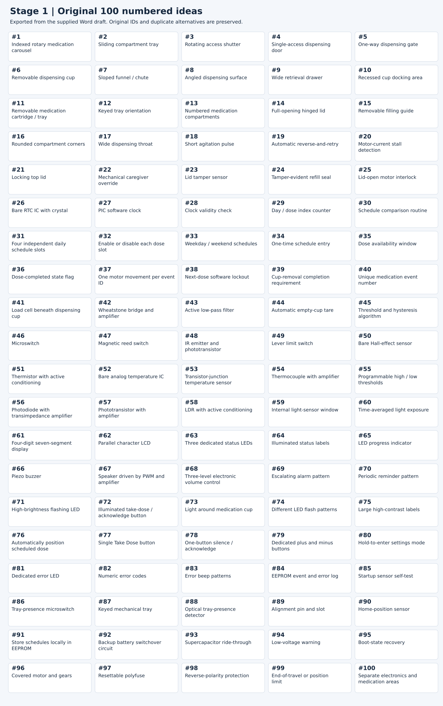
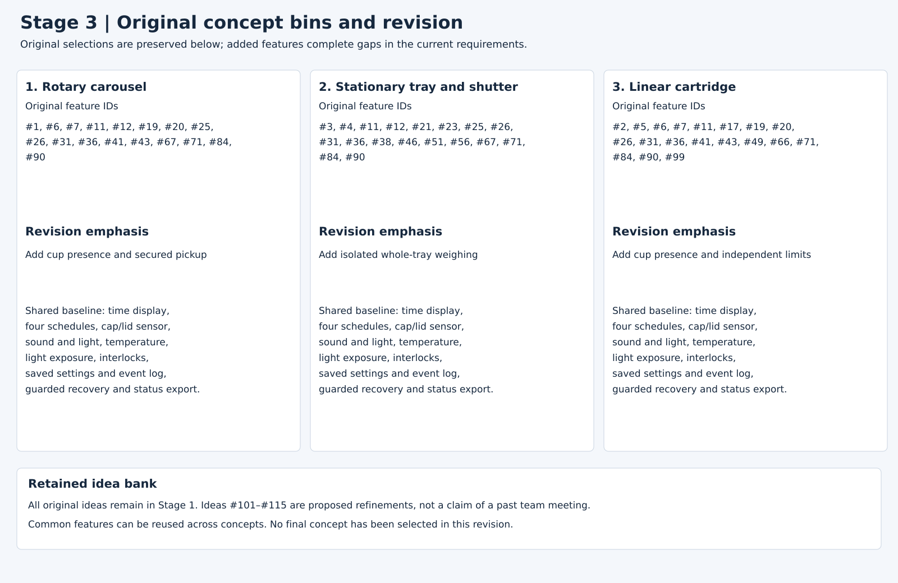
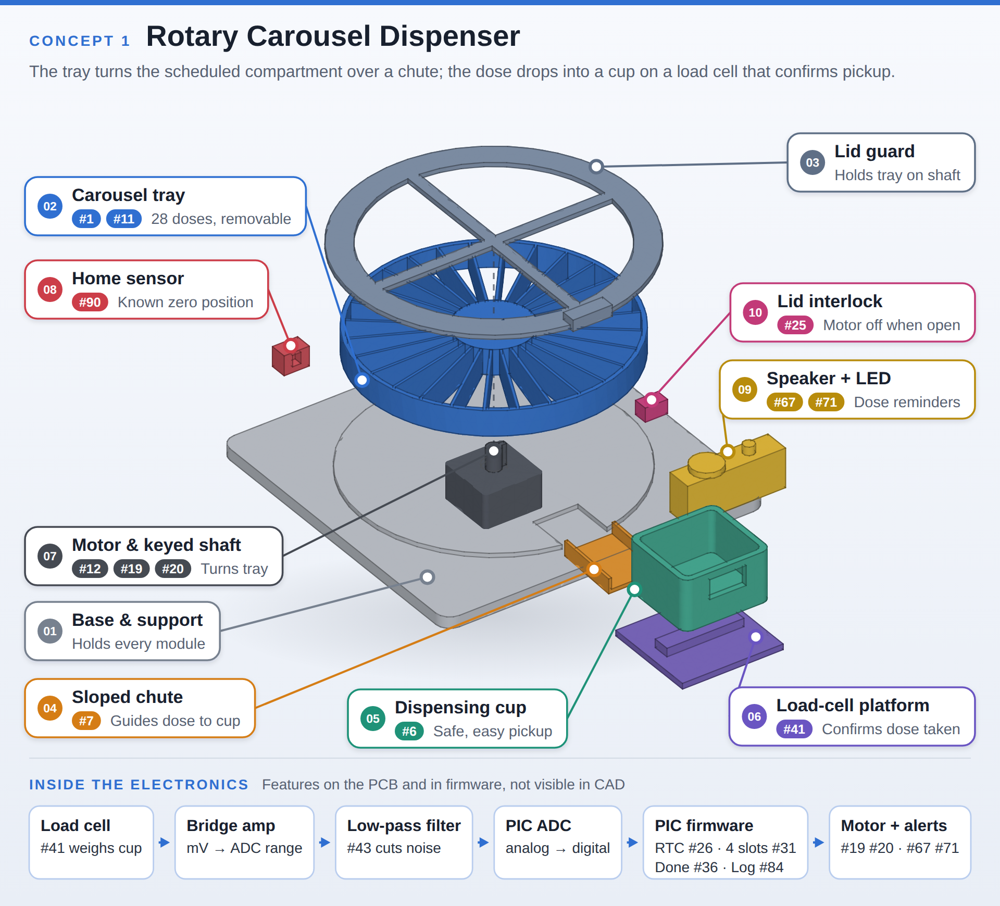
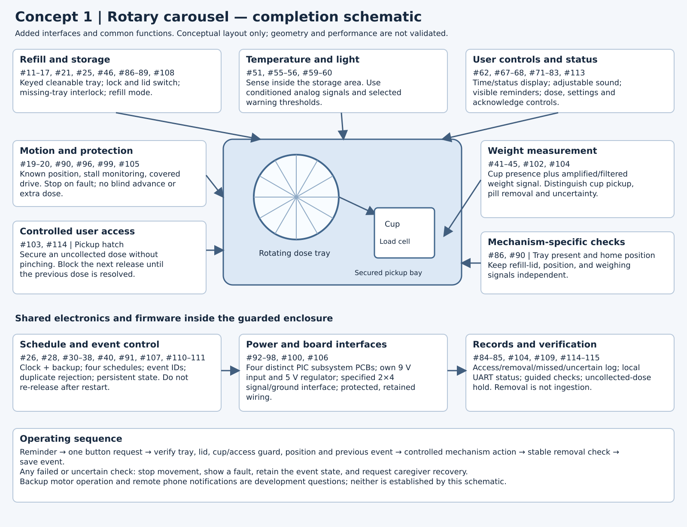
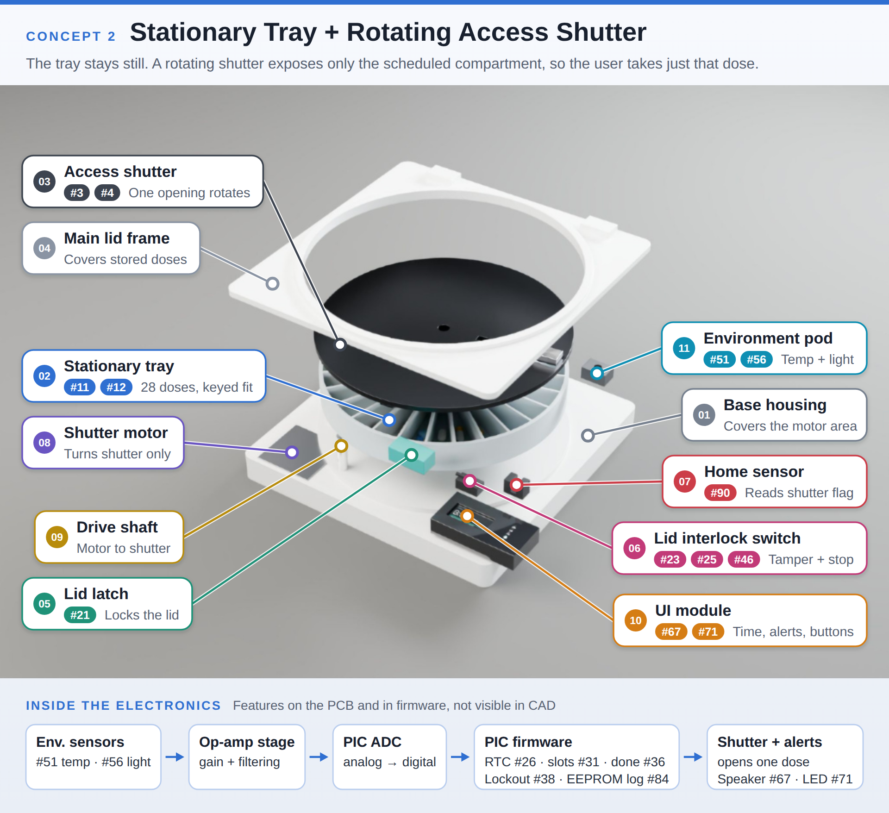
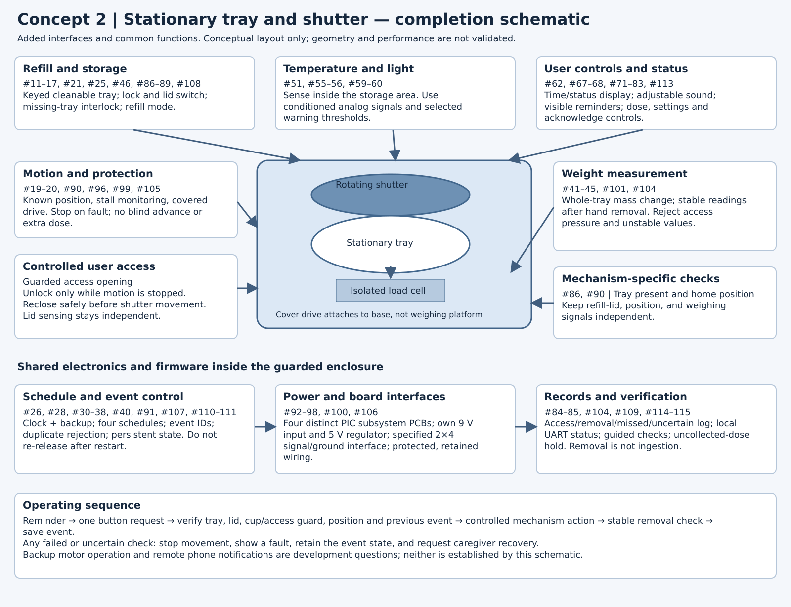
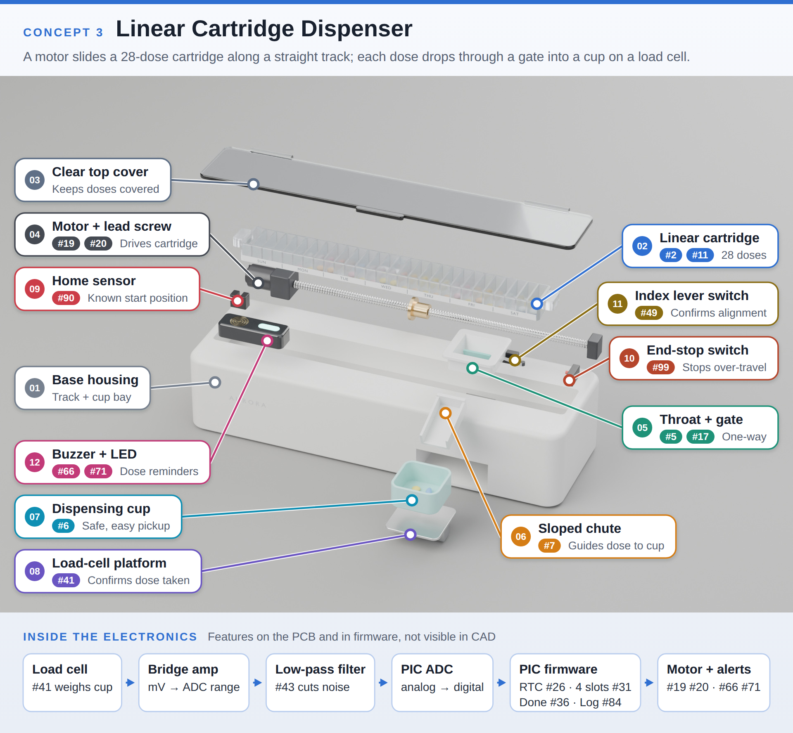
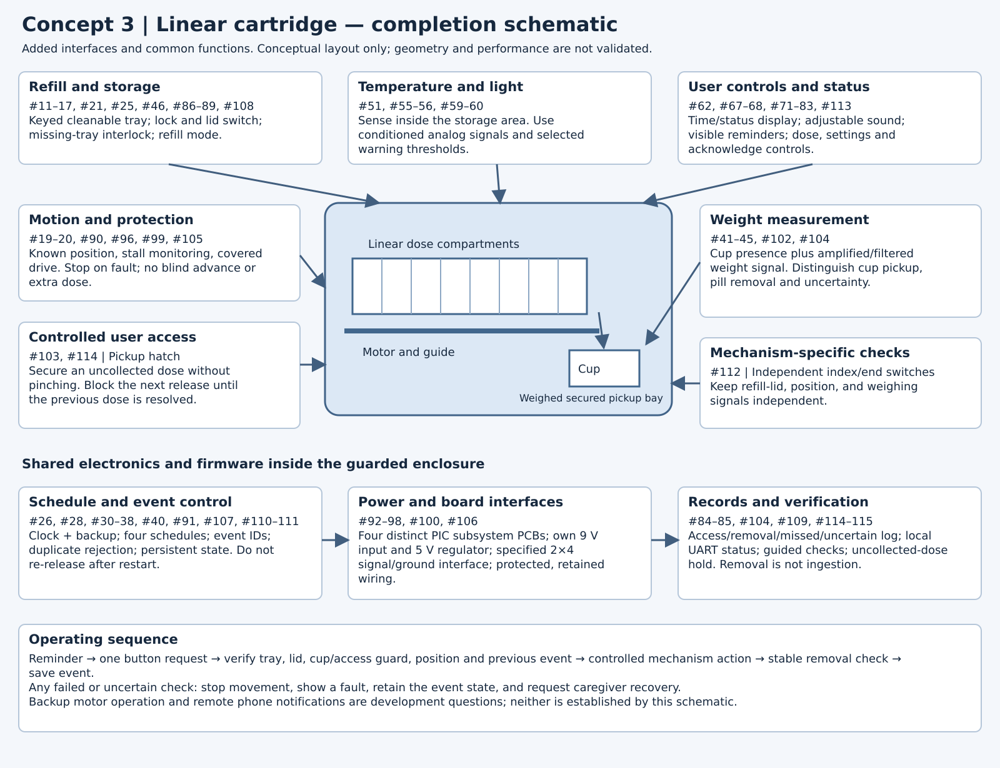

# Ideation and Concept Generation

## Project overview

Project Aurora is a smart medication storage device for adults who take several scheduled medications each day. The main users include older adults who want to manage their routine independently. Caregivers also need a simple way to refill the device, change the schedule, and check medication events.

The goal of this assignment is to compare three ways of providing the scheduled dose while keeping future doses unavailable. Each concept combines medication storage, weight and cap/lid sensing, reminders, and monitoring of storage conditions. These three concepts will help us compare options before choosing a design to prototype.

Weight and access sensors can provide evidence that medication was removed or accessed. They cannot confirm that someone swallowed it.

## 1. Requirements and priorities

The starting requirements come from our [User Needs and Benchmarking](03-User-Needs-and%20Benchmarking.md) and [Product Requirements](04-Product-Requirements.md) pages. The published user-needs page uses a 1–5 priority scale, and the product requirements identify Must and Should items.

Our concepts focus on the highest-priority user needs and Must requirements, especially preventing repeated dispensing, maintaining the correct time, detecting removal and access, and making reminders understandable. Refill, cleaning, environmental monitoring, and customization remain important supporting functions. Remote monitoring remains an idea to develop without making basic operation depend on an internet connection.

We use these priorities to shortlist useful features. Each concept still needs to meet the Must requirements, even when another feature seems easier to build.

| Focus | Published priority or requirement | Features considered |
| --- | --- | --- |
| Dose separation and controlled access | Priority 5; PD1, SF1, SF2 | 1–5, 21–25, 36–40 |
| Accurate timing and saved schedules | Priority 5; SW1–SW4, C1–C2 | 26–38, 79–80, 91, 95 |
| Removal and cap/lid sensing | SW5–SW6 are Must | 39, 41–50 |
| Clear reminders and controls | Priority 5 for clear reminders and simple controls; UX1–UX4 | 61–83 |
| Reliability and fault handling | Priority 5; M1, M4, SF3–SF5 | 18–20, 84–100 |
| Easy collection, refill and cleaning | Collection priority 5, refill priority 4; PD2–PD4, M2–M3 | 6–17, 86–89 |
| Storage conditions | SW7 is Should; stated project objective | 51–60 |
| Caregiver support and power continuity | Missed-dose alerts and essential operation during outage are priority 5 user needs | 84, 91–95; refinements 109–111, 114 |

### Course constraints that affect the concepts

Each teammate must design a subsystem PCB using the PIC18F57Q43 Curiosity Nano, the required power circuit, and the specified board connector. The project needs distinct sensing and actuation functions built with our own circuits. Ready-made peripheral boards cannot replace the graded functions, and a standalone LED, switch, or buzzer does not meet the complex sensing or actuation requirement by itself.

The course budget is $60 per team member, subject to the course exclusions. We will work out subsystem assignments, connector pinouts, and signal directions in the block-diagram assignment after comparing the concepts.

## 2. Initial brainstorm record

The table below lists the initial ideas, the needs they address, and how they could work. Ideas #12 and #87 both describe keyed tray installation. We keep both entries in this initial list and combine them during refinement.

*Initial idea list.*

| Idea | Requirement or need | Feature | Detail |
| --- | --- | --- | --- |
| 1 | Keep doses separated / block future doses | Indexed rotary medication carousel | A segmented tray rotates so only the scheduled compartment lines up with the dispensing area. |
| 2 | Keep doses separated / block future doses | Sliding compartment tray | A row of dose compartments moves until the scheduled dose lines up with the access opening. |
| 3 | Keep doses separated / block future doses | Rotating access shutter | Medication stays in place while a rotating cover exposes only the scheduled compartment. |
| 4 | Keep doses separated / block future doses | Single-access dispensing door | A small door opens only for the dose that is currently available. |
| 5 | Keep doses separated / block future doses | One-way dispensing gate | Pills can move toward the user but the user cannot reach backward into stored medication. |
| 6 | Easy medication removal | Removable dispensing cup | The scheduled dose drops into a cup that can be lifted out without reaching near moving parts. |
| 7 | Easy medication removal | Sloped funnel / chute | Angled surfaces guide the full dose toward the collection cup and reduce places where pills can stop. |
| 8 | Easy medication removal | Angled dispensing surface | Gravity directs pills away from the mechanism and toward the retrieval area. |
| 9 | Easy medication removal | Wide retrieval drawer | The user pulls out a shallow drawer instead of reaching through a small opening. |
| 10 | Easy medication removal | Recessed cup docking area | The cup sits in a fixed location with enough space for the user to grip and remove it. |
| 11 | Easy refill | Removable medication cartridge / tray | The caregiver removes the full tray and fills it outside the device. |
| 12 | Easy refill | Keyed tray orientation | The tray shape allows it to fit correctly in only one direction. |
| 13 | Easy refill | Numbered medication compartments | Clear numbers help the caregiver match each compartment to the intended dose time. |
| 14 | Easy refill | Full-opening hinged lid | The main lid opens far enough that it does not interfere while the caregiver refills the tray. |
| 15 | Easy refill | Removable filling guide | A simple guide identifies which compartment corresponds to each day or medication time. |
| 16 | Reduce pill jams | Rounded compartment corners | Rounded internal corners reduce locations where tablets or capsules can become trapped. |
| 17 | Reduce pill jams | Wide dispensing throat | The opening is larger than the expected pill sizes so the dose is less likely to bridge or jam. |
| 18 | Reduce pill jams | Short agitation pulse | The motor briefly moves back and forth if medication does not leave the compartment normally. |
| 19 | Recover from pill jams | Automatic reverse-and-retry | If resistance is detected, the motor backs up and attempts the dispensing motion again. |
| 20 | Detect pill jams | Motor-current stall detection | Higher-than-normal motor current is used as an indication that the mechanism may be jammed. |
| 21 | Secure medication | Locking top lid | The storage tray stays closed during normal use and is opened only for refilling or service. |
| 22 | Secure medication | Mechanical caregiver override | A protected latch or key gives caregiver access if the electronics fail. |
| 23 | Detect unauthorized access | Lid tamper sensor | The system detects and can record when the main storage lid is opened. |
| 24 | Tamper awareness | Tamper-evident refill seal | A simple physical indicator shows whether the medication storage area was opened. |
| 25 | Safe dispensing | Lid-open motor interlock | The motor is disabled whenever the main medication lid is open. |
| 26 | Keep accurate date and time | Bare RTC IC with crystal | A dedicated real-time clock keeps medication time accurately without relying on an internet connection. |
| 27 | Keep accurate date and time | PIC software clock | The microcontroller tracks seconds, minutes, and hours using an internal timing routine. |
| 28 | Keep accurate date and time | Clock validity check | At startup the firmware checks for an invalid or reset clock before medication dispensing is allowed. |
| 29 | Track medication position | Day / dose index counter | Software tracks which day and medication position should be active. |
| 30 | Dispense at the correct time | Schedule comparison routine | Firmware continuously compares the current time with the programmed medication times. |
| 31 | Support multiple daily doses | Four independent daily schedule slots | At least four medication times can be stored and handled separately each day. |
| 32 | Flexible scheduling | Enable or disable each dose slot | Individual medication times can be turned on or off without deleting the other schedule entries. |
| 33 | Flexible scheduling | Weekday / weekend schedules | The device can use a different set of dose times for different daily routines. |
| 34 | Flexible scheduling | One-time schedule entry | A temporary dose can be added without changing the normal repeating schedule. |
| 35 | Flexible medication timing | Dose availability window | A dose can remain available for a defined time window instead of being limited to one exact minute. |
| 36 | Prevent double dosing | Dose-completed state flag | Once a scheduled dose is recorded as completed, the same event cannot be completed again. |
| 37 | Prevent double dispensing | One motor movement per event ID | Each medication event can command the dispensing mechanism only once unless an authorized recovery is running. |
| 38 | Prevent early medication | Next-dose software lockout | The next compartment stays unavailable until its programmed dose window begins. |
| 39 | Confirm dose completion | Cup-removal completion requirement | The event is not marked complete until the system detects that medication was removed. |
| 40 | Keep medication history organized | Unique medication event number | Each scheduled dose receives an ID so the system can distinguish normal, repeated, missed, and error events. |
| 41 | Detect medication removal | Load cell beneath dispensing cup | A load cell measures the change in weight when the dose is present and when it is removed. |
| 42 | Measure load-cell signal | Wheatstone bridge and amplifier | The small load-cell signal is amplified into a range that the PIC ADC can measure reliably. |
| 43 | Stabilize weight measurement | Active low-pass filter | The analog signal is filtered to reduce vibration and electrical noise before ADC measurement. |
| 44 | Accurate weight measurement | Automatic empty-cup tare | The device stores the empty-cup value so measurements are based on the medication weight, not the cup weight. |
| 45 | Reliable medication detection | Threshold and hysteresis algorithm | The firmware ignores small weight changes so vibration does not create false medication-removal events. |
| 46 | Detect lid / cap access | Microswitch | A small mechanical switch changes state when the lid is opened or closed. |
| 47 | Detect lid / cap access | Magnetic reed switch | A magnet and reed switch provide non-contact lid open/closed detection. |
| 48 | Detect lid / cap access | IR emitter and phototransistor | The lid blocks or reflects an optical beam to indicate its position. |
| 49 | Detect lid / cap access | Lever limit switch | A lever switch confirms that the lid has reached the fully closed position. |
| 50 | Detect lid / cap access | Bare Hall-effect sensor | A Hall sensor and magnet detect lid position without mechanical contact. |
| 51 | Monitor storage temperature | Thermistor with active conditioning | A thermistor and op-amp circuit convert storage temperature into a stable analog signal for the PIC. |
| 52 | Monitor storage temperature | Bare analog temperature IC | An analog temperature sensor produces a voltage that changes with storage temperature. |
| 53 | Monitor storage temperature | Transistor-junction temperature sensor | A transistor junction and op-amp circuit are used to measure temperature. |
| 54 | Monitor storage temperature | Thermocouple with amplifier | A thermocouple signal is amplified so the controller can measure storage temperature. |
| 55 | Warn about unsafe temperature | Programmable high / low thresholds | The firmware warns the user when measured temperature goes outside the selected safe range. |
| 56 | Monitor storage light | Photodiode with transimpedance amplifier | A photodiode and op-amp convert light level into a voltage that the PIC can measure. |
| 57 | Monitor storage light | Phototransistor with amplifier | A phototransistor circuit detects excessive light reaching the medication area. |
| 58 | Monitor storage light | LDR with active conditioning | A photoresistor and active circuit provide a simple measure of the storage light level. |
| 59 | Measure medication exposure | Internal light-sensor window | The light sensor is positioned to measure light reaching the medication instead of general room light. |
| 60 | Avoid false light warnings | Time-averaged light exposure | A warning is generated only when excessive light continues for a set amount of time. |
| 61 | Show time and status | Four-digit seven-segment display | The device shows the current time and short numeric status or error codes. |
| 62 | Show detailed status | Parallel character LCD | The display can show short messages such as READY, TAKEN, MISSED, or ERROR. |
| 63 | Show status simply | Three dedicated status LEDs | Separate indicators show ready, taken, and error states without requiring menu navigation. |
| 64 | Improve accessibility | Illuminated status labels | Large words such as READY or ERROR light up so the user can understand the device quickly. |
| 65 | Show upcoming medication | LED progress indicator | A small row of LEDs gives a simple indication of how close the next medication time is. |
| 66 | Provide audible reminders | Piezo buzzer | A buzzer provides a simple audible alert when medication is ready. |
| 67 | Provide stronger audible reminders | Speaker driven by PWM and amplifier | The PIC generates tones through a speaker circuit so different reminder patterns can be used. |
| 68 | Customize reminder volume | Three-level electronic volume control | The user can select low, medium, or high reminder volume. |
| 69 | Make reminders hard to miss | Escalating alarm pattern | The reminder starts gently and becomes more noticeable if medication is not collected. |
| 70 | Avoid constant noise | Periodic reminder pattern | The alarm sounds at intervals instead of continuously for the entire dose window. |
| 71 | Provide visual reminders | High-brightness flashing LED | A bright visual alert is used together with the audible reminder. |
| 72 | Simplify normal use | Illuminated take-dose / acknowledge button | The control the user needs lights up when a medication action is required. |
| 73 | Direct the user to medication | Light around medication cup | The collection area lights up so the user can immediately see where to retrieve the dose. |
| 74 | Communicate status without text | Different LED flash patterns | Different patterns identify ready, missed-dose, and error states. |
| 75 | Improve accessibility | Large high-contrast labels | Buttons and medication areas use large text and strong contrast for older users. |
| 76 | Reduce user actions | Automatically position scheduled dose | The mechanism moves the correct dose into position when the medication event begins. |
| 77 | Simplify normal use | Single Take Dose button | One large button performs the normal user action instead of requiring menu navigation. |
| 78 | Simplify reminder control | One-button silence / acknowledge | The user can stop the audible reminder with one obvious control. |
| 79 | Simplify setup | Dedicated plus and minus buttons | Medication times can be changed directly with simple adjustment buttons. |
| 80 | Prevent accidental setting changes | Hold-to-enter settings mode | The user must intentionally hold a button before schedule settings can be edited. |
| 81 | Clearly indicate failures | Dedicated error LED | A separate indicator immediately shows that the device needs attention. |
| 82 | Support troubleshooting | Numeric error codes | Short codes identify specific faults such as jam, missing tray, or sensor error. |
| 83 | Support accessible troubleshooting | Error beep patterns | Basic fault types can also be communicated through different audible patterns. |
| 84 | Keep medication history | EEPROM event and error log | Taken, missed, and fault events stay stored after power is removed. |
| 85 | Check system health | Startup sensor self-test | The firmware checks important sensors and states before normal operation is enabled. |
| 86 | Detect installed medication tray | Tray-presence microswitch | The dispenser is prevented from operating when the medication tray is missing. |
| 87 | Prevent incorrect tray installation | Keyed mechanical tray | The tray geometry prevents installation in the wrong orientation. |
| 88 | Detect installed medication tray | Optical tray-presence detector | An IR emitter and detector confirm that the tray is inserted. |
| 89 | Keep tray aligned | Alignment pin and slot | Mechanical locating features place the tray in the same position every time. |
| 90 | Know mechanism position | Home-position sensor | An optical, magnetic, or mechanical sensor establishes the mechanism's known zero position. |
| 91 | Operate without internet | Store schedules locally in EEPROM | Medication times are stored on the device so normal operation does not depend on a network. |
| 92 | Handle temporary power failure | Backup battery switchover circuit | A backup supply keeps essential functions working during a wall-power outage. |
| 93 | Handle short power interruption | Supercapacitor ride-through | Stored energy keeps the controller alive during very short power interruptions. |
| 94 | Warn about bad supply voltage | Low-voltage warning | The device warns the user before supply voltage becomes too low for reliable operation. |
| 95 | Recover after power loss | Boot-state recovery | After restart the device reloads schedule, event state, and mechanism position instead of starting blindly. |
| 96 | Protect the user from movement | Covered motor and gears | Moving drivetrain parts are enclosed so fingers cannot reach pinch points. |
| 97 | Protect electronics | Resettable polyfuse | A resettable fuse limits damaging current during an electrical fault. |
| 98 | Protect electronics | Reverse-polarity protection | The input circuit protects the device if power is connected with the wrong polarity. |
| 99 | Protect the mechanism | End-of-travel or position limit | The mechanism stops before it can force itself beyond its intended range. |
| 100 | Separate medication from electronics | Separate electronics and medication areas | The enclosure keeps pills and user fingers away from PCBs, wires, and moving components. |

## 3. Sorting and ranking

### Functional groups

We organized the 100 ideas into seven functional groups. Each idea appears once below, although a feature can be used in more than one concept.

*Initial ideas organized into seven functional groups.*

| Group | Idea IDs | Purpose |
| --- | --- | --- |
| Medication storage, security, and refill | 1, 2, 3, 4, 5, 6, 7, 8, 9, 10, 11, 12, 13, 14, 15, 16, 17, 21, 22, 23, 24 | Store, separate, secure, refill, and collect medication. |
| Dispensing mechanism and mechanical safety | 18, 19, 20, 25, 76, 86, 87, 88, 89, 90, 96, 99, 100 | Move the mechanism, establish position, detect faults, and protect users. |
| Scheduling, dose logic, and local data | 26, 27, 28, 29, 30, 31, 32, 33, 34, 35, 36, 37, 38, 39, 40, 91, 95 | Keep time, handle schedules, prevent repeated release, and recover state. |
| Medication removal and access sensing | 41, 42, 43, 44, 45, 46, 47, 48, 49, 50 | Measure medication removal and detect cap/lid access. |
| Environmental monitoring | 51, 52, 53, 54, 55, 56, 57, 58, 59, 60 | Measure temperature and light at the medication storage area. |
| Interface, reminders, and accessibility | 61, 62, 63, 64, 65, 66, 67, 68, 69, 70, 71, 72, 73, 74, 75, 77, 78, 79, 80, 81, 82, 83 | Provide understandable displays, controls, sounds, and lights. |
| Reliability, power, and electrical protection | 84, 85, 92, 93, 94, 97, 98 | Keep records, check the system, and protect the power and electronics. |

### Qualitative shortlist

We compare the ideas using five questions: Does the feature meet an important requirement? Can we build it? Does it fit the course requirements? Will it work with the other subsystems? Does it support reliable and safe operation?

The table lists promising features and the reason for keeping each one. It is a qualitative shortlist, with no numerical ranking or order of preference. We will compare performance through prototype tests before choosing a final concept. Other ideas remain available in the initial list.

| Group | Idea | Shortlisted feature | Original total | Reason in the original draft |
| --- | --- | --- | --- | --- |
| Medication storage, security, and refill | #1 | Indexed rotary medication carousel | 25/25 | Good for separating doses and works well with one motor. |
| Medication storage, security, and refill | #11 | Removable medication tray | 24/25 | Makes refill and cleaning easier. |
| Medication storage, security, and refill | #12 | Keyed tray orientation | 23/25 | Simple way to prevent putting the tray in backward. |
| Dispensing mechanism and mechanical safety | #90 | Home-position sensor | 25/25 | Gives the mechanism a known starting position. |
| Dispensing mechanism and mechanical safety | #20 | Motor-current jam detection | 23/25 | Can detect when the motor is stalled. |
| Dispensing mechanism and mechanical safety | #19 | Automatic reverse-and-retry | 22/25 | Gives the device one simple way to recover from a jam. |
| Scheduling, dose logic, and local data | #26 | RTC for local timekeeping | 25/25 | Keeps accurate time without needing internet. |
| Scheduling, dose logic, and local data | #36 | Dose-completed state flag | 25/25 | Helps prevent the same dose from being counted twice. |
| Scheduling, dose logic, and local data | #37 | One dispense per medication event | 25/25 | Prevents a second dispense for the same scheduled dose. |
| Medication removal and access sensing | #43 | Active low-pass filter | 25/25 | Makes the weight signal more stable. |
| Medication removal and access sensing | #45 | Threshold + hysteresis in software | 25/25 | Prevents vibration from causing false readings. |
| Medication removal and access sensing | #41 | Load cell under dispensing cup | 24/25 | Directly checks when medication is in the cup and when it is removed. |
| Environmental monitoring | #51 | Thermistor with signal conditioning | 25/25 | Simple way to measure storage temperature. |
| Environmental monitoring | #56 | Photodiode with amplifier | 24/25 | Measures light exposure using an analog circuit. |
| Environmental monitoring | #55 | Temperature warning thresholds | 24/25 | Turns the temperature reading into a useful warning. |
| Interface, reminders, and accessibility | #71 | High-brightness flashing LED | 24/25 | Provides a simple visual reminder. |
| Interface, reminders, and accessibility | #72 | Illuminated Take Dose button | 24/25 | Makes the normal user action obvious. |
| Interface, reminders, and accessibility | #67 | Speaker with PWM and amplifier | 23/25 | Provides clear audible reminders. |
| Reliability, power, and electrical protection | #84 | EEPROM event/error log | 25/25 | Stores taken, missed, and error events. |
| Reliability, power, and electrical protection | #85 | Startup sensor self-test | 25/25 | Checks important parts before normal operation. |
| Reliability, power, and electrical protection | #94 | Low-voltage warning | 23/25 | Warns before the supply becomes unreliable. |

### Interpretation and refinements

The carousel, removable tray, and keyed fit provide a useful storage combination. Homing and stall detection support controlled movement, but a retry must not release an additional dose. An RTC is a useful timing candidate, although its actual accuracy, backup circuit, and communication interface still need testing. Filtering and hysteresis may reduce false weight readings; neither can guarantee reliable detection without calibration and a suitable load cell.

The stationary tray needs a way to measure dose removal, and all three designs need clear access sensing and a way to handle uncollected doses. Ideas #12 and #87 are combined into one keyed-tray feature so they are not counted as separate improvements.

The following proposed refinements address gaps in the three concepts.

| New ID | Need | Refined feature | Built from | How it works | Requirement link |
| --- | --- | --- | --- | --- | --- |
| 101 | Weight sensing for the shutter concept | Isolated weighing platform under the stationary tray | 41, 42, 43, 45 | Mount the tray on a load cell independently of the motor and cover. Compare stable readings before and after access; reject readings while a hand touches the tray. | SW5 |
| 102 | Reliable cup measurements | Independent cup-presence switch | 39, 41, 44 | Distinguish a missing cup from a cup with medication removed. Block dispensing if the cup is absent. | SW5, SF4 |
| 103 | Secure expired doses | Lockable pickup hatch | 4, 21, 35, 38 | Place the cup behind a monitored hatch so an uncollected dose can be secured. Do not close a powered barrier on a hand. If it cannot secure the dose, stop and request help. | PD1, SF1 |
| 104 | Unambiguous medication records | Separate access, removal, missed, and uncertain states | 36, 39, 40, 84 | Opening a lid or removing a cup records access only. Stable weight change supports removal. No sensor result is labeled proof that medication was swallowed. | SW5, SW6, SF2 |
| 105 | Safer fault recovery | Recovery limited to the same compartment | 19, 20, 37, 90 | Allow at most one controlled retry only when position is known and no dose release was detected. Otherwise stop for caregiver recovery. Never advance to another dose to clear a fault. | SW3, SF2, SF4 |
| 106 | Detect stalled team communication | Board heartbeat and timeout | 85, 95 | Each subsystem reports that it is active. A missing required response blocks a new dispense and shows an error. | M1, M4, SF4 |
| 107 | Prevent duplicate actions between boards | Event-ID command and acknowledgement | 37, 40, 84 | A motor board acknowledges each event ID and rejects a repeated dispense command for that ID. | SW3, SF2 |
| 108 | Safe medication refill | Caregiver refill and re-arm mode | 11, 21, 25, 28 | Opening the refill lid disables motion. Closing it does not immediately dispense; tray position, schedule, and sensor checks must pass first. | SF3, SF4 |
| 109 | Useful caregiver information | Wired UART status export | 81, 84, 91 | Send timestamped removal, missed-dose, and fault messages to a connected computer. This supports a local demonstration; a remote phone notification service remains a later extension. | Caregiver needs, SW8 |
| 110 | Reliable time after a power interruption | RTC backup supply and clock-loss flag | 26, 28, 92, 95 | Maintain the clock using a suitable backup circuit. If the time cannot be trusted at restart, request clock setup before releasing medication. | SW1, SW4 |
| 111 | Protect records during interrupted writes | Two-copy nonvolatile event record | 36, 40, 84, 95 | Write a versioned record with an integrity check and commit marker. An incomplete write must not make a completed event available again. | SW3, SW4, SF2 |
| 112 | Confirm linear alignment | Dedicated linear index and end switches | 2, 89, 90, 99 | Use separate carriage-position switches for the linear concept. Keep the lid switch dedicated to lid sensing. | PD4, SF4 |
| 113 | Handle quiet hours without hiding faults | Separate reminder and fault sound settings | 68, 70, 78, 81 | Permit optional reminder sounds to be disabled while keeping visible ready, missed, and error indicators active. | C3, UX2, UX4 |
| 114 | Avoid mixing missed and later doses | Uncollected-dose hold state | 35, 36, 38, 41 | An uncollected or uncertain dose blocks the next release until the caregiver resolves it. Do not automatically add another dose to an occupied cup. | PD1, SW3, SF1, SF2 |
| 115 | Verify the assembled prototype | Guided test mode with test objects | 85, 90, 94 | A service mode exercises sensors, controls, reminders, power checks, and dispensing with test objects before normal use. | M4, PD4 |

## 4. Three product concepts

*Stage 3 preserves the original concept selections and identifies what this revision adds. The full original idea bank remains above; unused alternatives are not deleted.*

### Shared features required in all three concepts

**Essential functions.** Each concept includes scheduling, controlled access, removal and lid sensing, reminders, event records, and fault handling. We also include temperature and light monitoring to support our storage-condition objective. The mechanism and location of the load cell differ between designs.

| Idea IDs | Common feature | Requirements | Purpose |
| --- | --- | --- | --- |
| 26, 28, 30–32, 110 | RTC, clock validation, and four individually editable schedules | SW1–SW2, C1–C2 | Keep time and start each event within the ±1 minute requirement; verify accuracy by test. |
| 36–38, 40, 104, 107, 111, 114 | Event IDs, lockout, persistent event state, and uncollected-dose hold | SW3–SW4, SF2 | Reject repeated release requests, retain schedules, and block a later dose while the previous one is unresolved. |
| 41–45, 101 or 102 | Load cell, bridge amplifier, active filter, and stable measurement logic | SW5 | Sense removal using the cup in Concepts 1 and 3, or the isolated tray in Concept 2. |
| 21, 25, 46 | Locking refill lid with cap/lid switch and motor interlock | SW6, SF1, SF5 | Record open/closed access and inhibit motor movement while the lid is open. Treat this enclosure lid as the medication-container cap. |
| 51, 55–56, 59–60 | Temperature and light sensing with configurable warnings | SW7 | Measure conditions at the storage area; choose thresholds for the intended medication conditions before testing. |
| 62, 67–68, 71–72, 75, 78–83, 113 | Time/status display, speaker, LED, simple buttons and reminder settings | UX1–UX4, C1–C3 | Show time, ready, missed, and fault states; provide normal sound-and-light reminders and adjustable optional sound. |
| 11–17, 87, 89, 100 | Removable, keyed, cleanable dose tray and separated electronics | PD1–PD4, M2–M3, SF5 | Keep doses separated, make refill understandable, and allow cleaning without reaching live wiring or gears. |
| 20, 25, 85–86, 90, 96, 99, 105, 108 | Tray/lid interlocks, homing, guarded mechanism and controlled recovery | M4, SF3–SF5 | Verify position and installation before motion; stop and indicate faults rather than releasing an uncertain dose. |
| 84, 91–95, 97–98, 106, 110–111 | Saved settings, power checks, circuit protection and restart checks | SW4, SW8, M1, M4 | Core operation is local. After a power interruption, recover safely without an automatic repeated dispense. |
| 109, 115 | Wired status reporting and guided functional check | Caregiver needs, M4 | Demonstrate readable event messages and test the completed prototype with test objects. |

### Concept 1 — Rotary carousel dispenser

A removable circular tray stores preloaded doses. At the scheduled time, the device shows a reminder. One press of the illuminated dose button requests release after the interlocks pass. A motor rotates the scheduled compartment to a chute, which delivers medication to a cup on a load cell. Future compartments stay covered.

| Feature set | IDs | Connection to needs |
| --- | --- | --- |
| Original concept bin | 1, 6, 7, 11, 12, 19, 20, 25, 26, 31, 36, 41, 43, 67, 71, 84, 90 | Preserves the original carousel, cup, chute, tray, motor, timing, sensing, reminder, and logging selections. |
| Completed concept | Original bin + every shared-baseline row above + 102, 103, 114 | Adds cup presence, a secured retrieval area, and the uncollected-dose hold state. |
| Distinct mechanism | 1, 6–7, 11–12, 20, 90 | Compact circular storage, gravity delivery, easier refill, and known motor position. |

**Normal interaction.** The user sees/hears the reminder, presses once, and collects the dose when the mechanism has stopped. 

**Strengths.** The circular layout uses space efficiently, and a separate cup provides a practical place to measure small weight changes.

**Main challenge.** The outlet must release different test-object sizes without bridging. Indexing, isolation of the load cell, and the pickup-hatch mechanism need testing. Motor current can suggest a stall, but it does not prove whether every pill left the tray.

### Concept 2 — Stationary tray with rotating access shutter

The medication tray stays still. A motor moves a guarded cover so only the scheduled compartment can be reached. The user removes the medication directly instead of receiving it through a chute. This removes one pill-transfer step while keeping a distinct mechanical layout.

| Feature set | IDs | Connection to needs |
| --- | --- | --- |
| Original concept bin | 3, 4, 11, 12, 21, 23, 25, 26, 31, 36, 38, 46, 51, 56, 67, 71, 84, 90 | Preserves the stationary tray, moving cover, lock, lid sensing, environmental sensors, timing, and reminder selections. |
| Completed concept | Original bin + every shared-baseline row above + 101, 104, 114 | Adds required weight sensing and explicit removal/uncertain states. |
| Distinct mechanism | 3–4, 11–12, 21, 38, 90, 101 | Expose one compartment, avoid a transfer chute, and measure removal through tray mass change. |

**Normal interaction.** The reminder starts; one button press requests the scheduled opening. The cover moves only while the access opening is guarded. Once it stops, the user reaches through the access opening and removes the dose. 

**Strengths.** Direct access reduces dependence on gravity transfer and chute geometry. The tray remains removable for refilling.

**Main challenge.** A small dose may be difficult to resolve against the mass of a full tray. Hand pressure, pill placement, and vibration can distort readings. Load-cell capacity, amplification, noise, and minimum detectable dose mass must be tested. 

### Concept 3 — Linear cartridge dispenser

A motor drives a removable straight cartridge along a guide. The scheduled compartment aligns with a fixed dispensing station and releases its dose into a weighed cup. Independent home, index, and end-position sensors help establish the carriage position.

| Feature set | IDs | Connection to needs |
| --- | --- | --- |
| Original concept bin | 2, 5, 6, 7, 11, 17, 19, 20, 26, 31, 36, 41, 43, 49, 66, 71, 84, 90, 99 | Preserves the linear cartridge, gate, cup, chute, weighing, timing, reminder, and limit-sensing selections. |
| Completed concept | Original bin + every shared-baseline row above + 102, 103, 112, 114 | Adds independent lid sensing, dedicated position switches, cup presence, secured pickup, and missed-dose handling. |
| Distinct mechanism | 2, 5–7, 17, 90, 99, 112 | Move compartments in a straight line, reduce outlet obstruction, and stop before the carriage reaches its travel limit. |

**Normal interaction.** After the reminder and one button press, the controller checks the cup, tray, lid, and mechanism position. The motor aligns the scheduled compartment, the dose enters the cup, and the user collects it after motion stops. Missing-cup and weight readings are interpreted together before recording the interaction.

**Strengths.** The straight path is easy to inspect, and the cartridge can be removed for refill. Position sensors provide clear reference points.

**Main challenge.** A long cartridge needs a larger enclosure and consistent alignment across its entire travel. Gate design, friction, and secure access to the cup require development.

### Comparison of the three concepts

| Area | Rotary carousel | Stationary tray and shutter | Linear cartridge |
| --- | --- | --- | --- |
| Main movement | Circular dose tray rotates | Cover rotates over a stationary tray | Dose cartridge moves in a straight line |
| Dose access | Gravity transfer into a cup | Direct access to one compartment | Gravity transfer into a cup |
| Weight sensing | Cup load cell plus cup-presence switch | Isolated whole-tray load cell | Cup load cell plus cup-presence switch |
| Cap/lid sensing | Independent refill-lid switch | Independent refill-lid switch | Independent refill-lid switch |
| Environmental sensing | Temperature and light | Temperature and light | Temperature and light |
| Fault response | Stop, indicate fault, preserve event ID | Stop cover motion; flag unstable/uncertain weight | Stop carriage; preserve event ID |
| Missed-dose handling | Secure pickup bay; block next release | Guard scheduled opening; block further access | Secure pickup bay; block next release |
| Expected advantage | Compact storage and separate weighing cup | Fewer pill-transfer surfaces | Straightforward layout and position references |
| Main uncertainty | Indexing, chute flow, and hatch design | Resolving dose mass against full tray mass | Travel length, alignment, and gate design |

We have not selected a final concept. The main differences to test are dispensing reliability, weight measurement, and mechanism size.

### Ideas retained for later use

All original and refined features remain in the tables above. Alternatives include a retrieval drawer (#9), fill guide (#15), reed or optical cap sensing (#47–48), alternate temperature sensors (#52–54), alternate light sensing (#57–58), a seven-segment display (#61), additional visual cues (#63–65, #73–74), an alternate buzzer (#66), optical tray detection (#88), and short power-loss ride-through (#93).

Caregiver phone notifications and extended battery operation remain unresolved development topics. The wired status demonstration (#109) is not equivalent to a working remote notification service, and saved settings or RTC backup alone do not keep a motorized dispenser operating during an outage.

## 5. Process discussion

We discussed our medication-storage ideas in an online meeting. Our starting point was the user-needs research and product requirements for Project Aurora. We focused on older adults who take several scheduled medications and caregivers who help with refilling and setup. The main problems we wanted to address were confusing controls, missed reminders, repeated dispensing, and difficulty collecting medication.

The ideas were organized in a Word document using a table with an idea number, the related need, a feature, and a short explanation of how it could work. The list contains 100 entries. Some describe different ways to solve the same problem, such as mechanical, magnetic, and optical lid sensors. Others describe supporting functions, such as storing a schedule or checking whether the tray is installed. Keeping the full list lets us return to an alternative if another approach proves difficult to build.

We grouped the ideas into seven areas: storage and refill, dispensing and mechanical safety, scheduling, removal and access sensing, environmental monitoring, the user interface, and reliability and power. This made it easier to see which functions each concept needed and which ideas could work together. The highest-priority needs guided the shortlist, especially controlled medication access, accurate timing, understandable reminders, and detection of dose removal.

The shortlist compares requirement fit, feasibility, course fit, integration, and reliability and safety. We describe why each feature is useful rather than assigning numerical scores without a complete scoring breakdown. We also combine the two keyed-tray ideas, #12 and #87, into one feature during refinement while keeping both in the initial list.

The three resulting concepts are a rotary carousel, a stationary tray with a rotating shutter, and a linear cartridge. The carousel and linear cartridge transfer medication into a separate cup. The stationary tray gives direct access to one compartment. Comparing these approaches highlighted two important questions: how to detect a small dose being removed, and how to secure a dose that is not collected during its scheduled window.

The proposed refinements address those questions with an isolated weighing platform for the stationary tray and monitored pickup hatches for the two cup-based concepts. Each design also needs independent lid sensing, motion interlocks, and clear event records. The record should distinguish access, removal, missed collection, and uncertain readings because these sensors cannot confirm swallowing.

We have not chosen a final design. The next step is to test the dispensing mechanisms and weight measurements using test objects, then compare the space, reliability, and build effort of each option. We will use those results to choose a concept and develop the subsystem assignments and board connections in the block-diagram work.

## 6. Development and verification questions

1. Can the weight sensor reliably detect the smallest dose we plan to test, including when the stationary tray is full?
2. Can each mechanism complete the required 20 consecutive cycles without a jam using the selected test objects?
3. What happens if power is lost during movement or just after medication is released? Can the device restart without releasing the same dose again?
4. Can the cap/lid, missing-tray, missing-cup, and position sensors be tested independently?
5. How will the pickup hatch or shutter remain secure without moving against a user's hand?
6. What temperature and light limits will we use for the stored medication, and how will we check the sensors against known readings?
7. How will we divide the subsystem work among teammates, and what signals will the boards need to share?
8. What level of backup operation and caregiver notification can the prototype actually demonstrate?

Planned checks include the ±1 minute timing test, four schedules in one day, schedule retention after power cycling, duplicate-event rejection, removal and lid-state demonstrations, sound-and-light reminders, adjustable settings, interlock fault tests, and the full assembled-system check. We will record the results when we test the prototype.

## References

- [Design Ideation assignment](https://embedded-systems-design.bitbucket.io/304/team-assignments/design-ideation/)
- [Fall 2026 EGR 304 Project Description](https://embedded-systems-design.bitbucket.io/304/course-info/project-description/)
- [Course Sequence Requirements](https://embedded-systems-design.bitbucket.io/3x4/course-sequence-requirements/)
- [Team 102 User Needs and Benchmarking](03-User-Needs-and%20Benchmarking.md)
- [Team 102 Product Requirements](04-Product-Requirements.md)
- Team 102, *Design Ideation.docx*. Initial brainstorming notes and concept sketches. The 100-entry idea list and seven functional groups are retained above.

