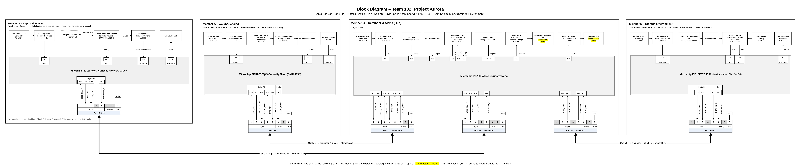

# Block Diagram, Process Diagram, and Message Structure

## Overview

This page shows how the four Project Aurora boards connect. Each teammate designs their own PCB around a Microchip PIC18F57Q43 Curiosity Nano, powered by a 9 V barrel jack and a 5 V linear regulator. The boards share information only through 8-pin ribbon cables that follow the course pinout: pins 1–5 digital, pins 6–7 analog, and pin 8 ground.

We use a hub-and-spoke layout. The Reminder & Alerts board is the hub because it keeps the dose schedule and gives the reminders. Each sensing board has its own cable to the hub.

| Board | Owner | Subsystem | Sensor / actuator | Main chips | Connectors |
|---|---|---|---|---|---|
| Hub | Taylor Callo | Reminder & Alerts | Actuator: speaker and high-brightness LED | LM386N-1 audio amp, AO3400A MOSFET, MCP7940N real-time clock | J1, J2, J3 |
| Spoke 1 | Natalia Castillo-Diaz | Weight Sensing | Sensor: 100 g load cell | AD623ANZ instrumentation amp, RC low-pass filter | J1 |
| Spoke 2 | Arya Padiyar | Cap / Lid Sensing | Sensor: linear Hall-effect sensor | DRV5055A1QLPG Hall sensor, LM393P comparator | J1 |
| Spoke 3 | Sam Kholmuminov | Storage Environment | Sensors: thermistor and photodiode | MCP6002 dual op-amp | J1 |

## Team Discussion

### How do we divide functions to minimize connections?

Each board processes its own sensor and sends the hub only short status signals, such as "dose removed" or "cap open," instead of raw readings. Only the hub needs to know the schedule, so it is the only board with more than one connector, and the sensing boards never connect to each other. The whole system uses three cables and 14 signal lines, with spare pins left on every cable.

### Does the layout meet the minimum project requirements?

- Natalia Castillo-Diaz (Weight): load cell, AD623 instrumentation amplifier, and RC filter into the ADC.
- Arya Padiyar (Cap / Lid): Hall-effect sensor into the ADC, plus an LM393 comparator for a clean open/closed signal.
- Taylor Callo (Hub): PWM tone through an LM386 amplifier to a speaker, plus a MOSFET-switched LED.
- Sam Kholmuminov (Environment): thermistor buffer and photodiode transimpedance amplifier (MCP6002) into the ADC.

Every board has a Curiosity Nano, a 5 V regulator, at least one ribbon connector, and its own sensing or actuation circuit built from different chips. Together the team has three sensing boards and one actuation board.

### What happens if we lose a teammate?

Each sensing board sends a 1 Hz heartbeat on pin 5. If a board stops, the hub shows an error and keeps running the others, so we lose one function instead of the whole system. Pull-down resistors make an unplugged cable read as "nothing happening." The hub is the biggest risk, so every sensing board also has its own LED or button and can be tested alone with a spare Curiosity Nano acting as the hub.

## Team Block Diagram

**Figure 1:** Team block diagram. Click the image to enlarge it. Source file: [team102-block-diagram.drawio](image/team102-block-diagram_1.drawio)

Arrows point toward the board that receives each signal. Gray pins are spare. Yellow "Manufacturer / Part #" fields will be filled in by each owner during component selection.

## Ribbon Cable Pin Assignments

All board-to-board signals use 3.3 V logic and are active HIGH. Every input that comes from another board has a 100 kΩ pull-down resistor.

Pins 1–5 are digital, pins 6–7 are analog, and pin 8 is ground on every cable.

### Cable 1: Hub J1 ↔ Weight board J1

| Pin | Signal | From | Hub | Weight | Meaning |
|:-:|---|:-:|:-:|:-:|---|
| 1 | DOSE_READY | Hub | RD0 | RD0 | Dose is due |
| 2 | DOSE_REMOVED | Weight | RD1 | RD1 | Dose lifted out |
| 3 | WEIGHT_FAULT | Weight | RD2 | RD2 | Bad reading |
| 4 | TARE_REQ | Hub | RD3 | RD3 | Re-zero scale |
| 5 | HEARTBEAT_A | Weight | RD4 | RD4 | 1 Hz "alive" |
| 6 | WEIGHT_LEVEL | Weight | RA0 | RA2 | 0–3.3 V = 0–100 g |
| 7 | spare | — | — | — | Not used |
| 8 | GND | — | GND | GND | Ground |

### Cable 2: Hub J2 ↔ Cap board J1

| Pin | Signal | From | Hub | Cap | Meaning |
|:-:|---|:-:|:-:|:-:|---|
| 1 | DOSE_READY | Hub | RD5 | RD0 | Dose is due |
| 2 | LID_OPEN | Cap | RD6 | RD1 | Cap is off |
| 3 | LID_FAULT | Cap | RD7 | RD2 | Magnet/sensor fault |
| 4 | spare | — | — | — | Not used |
| 5 | HEARTBEAT_B | Cap | RE0 | RD4 | 1 Hz "alive" |
| 6 | spare | — | — | — | Not used |
| 7 | spare | — | — | — | Not used |
| 8 | GND | — | GND | GND | Ground |

### Cable 3: Hub J3 ↔ Environment board J1

| Pin | Signal | From | Hub | Env. | Meaning |
|:-:|---|:-:|:-:|:-:|---|
| 1 | spare | — | — | — | Not used |
| 2 | TEMP_ALERT | Env. | RE1 | RD1 | Too hot/cold |
| 3 | LIGHT_ALERT | Env. | RE2 | RD2 | Too much light |
| 4 | spare | — | — | — | Not used |
| 5 | HEARTBEAT_D | Env. | RF2 | RD4 | 1 Hz "alive" |
| 6 | TEMP_LEVEL | Env. | RA1 | RA2 | 0–3.3 V = 0–50 °C |
| 7 | spare | — | — | — | Not used |
| 8 | GND | — | GND | GND | Ground |

## Next Steps

- Each owner will confirm parts during component selection and update their block on this diagram before the external design review.
- Individual block diagrams will be updated to match these pin tables.
- The process diagram and message structure will be added with the software proposal.
